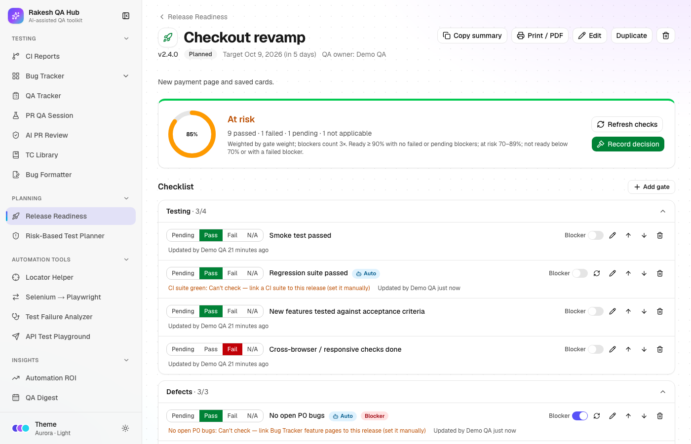
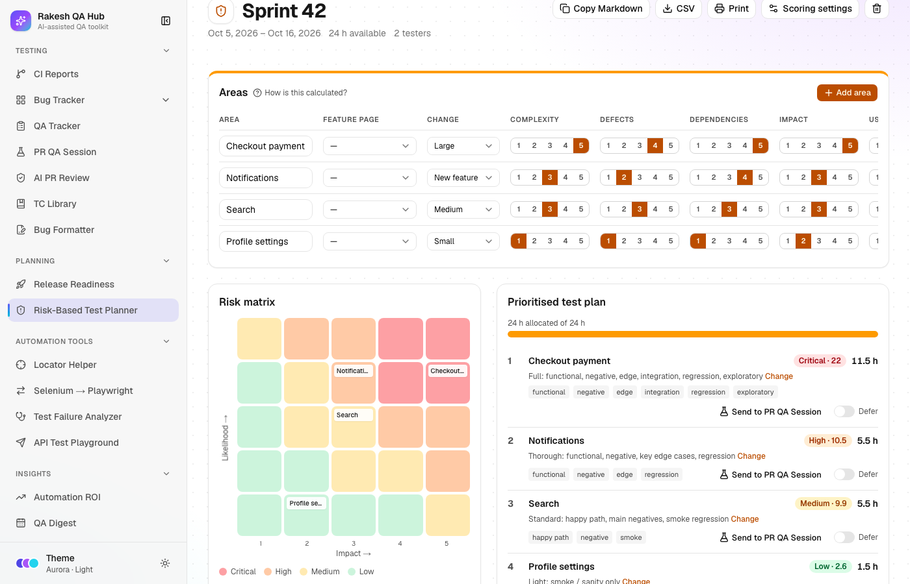
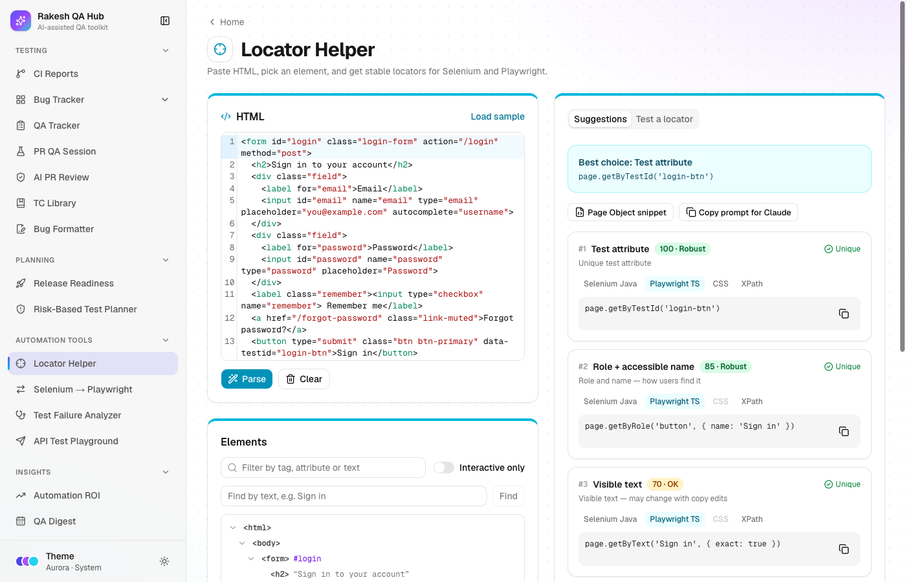
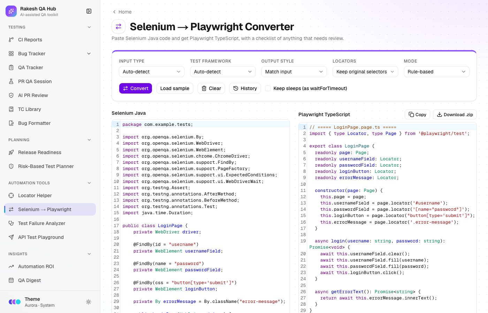
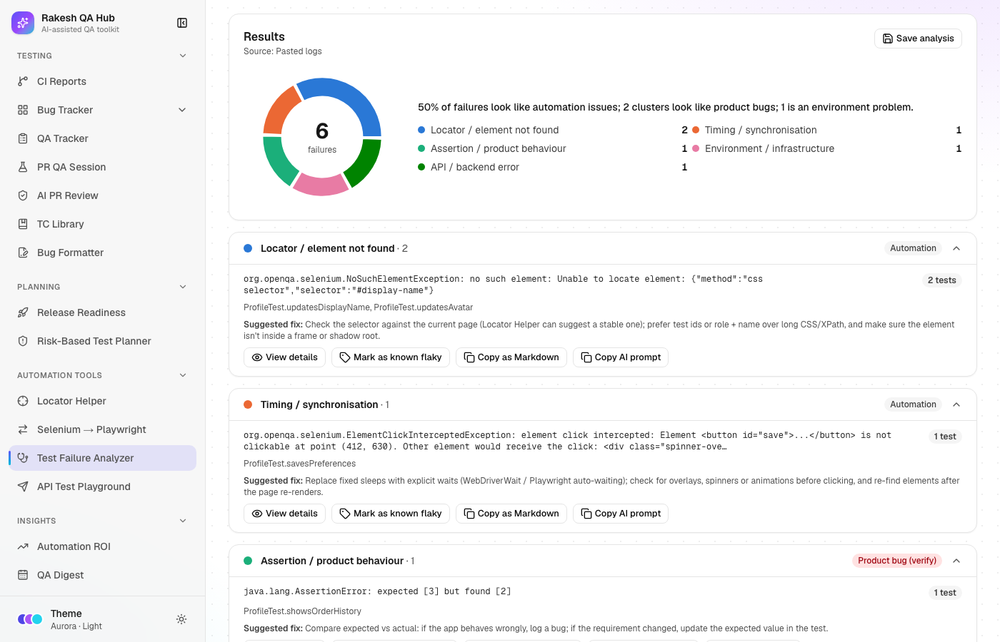
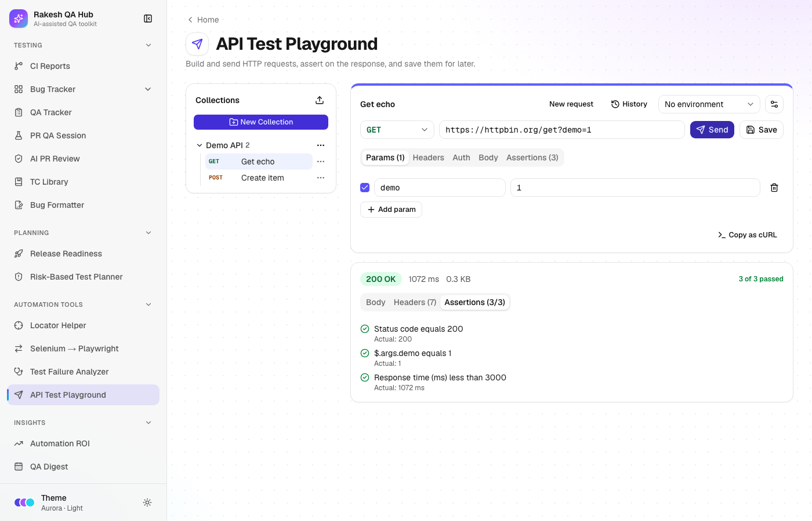
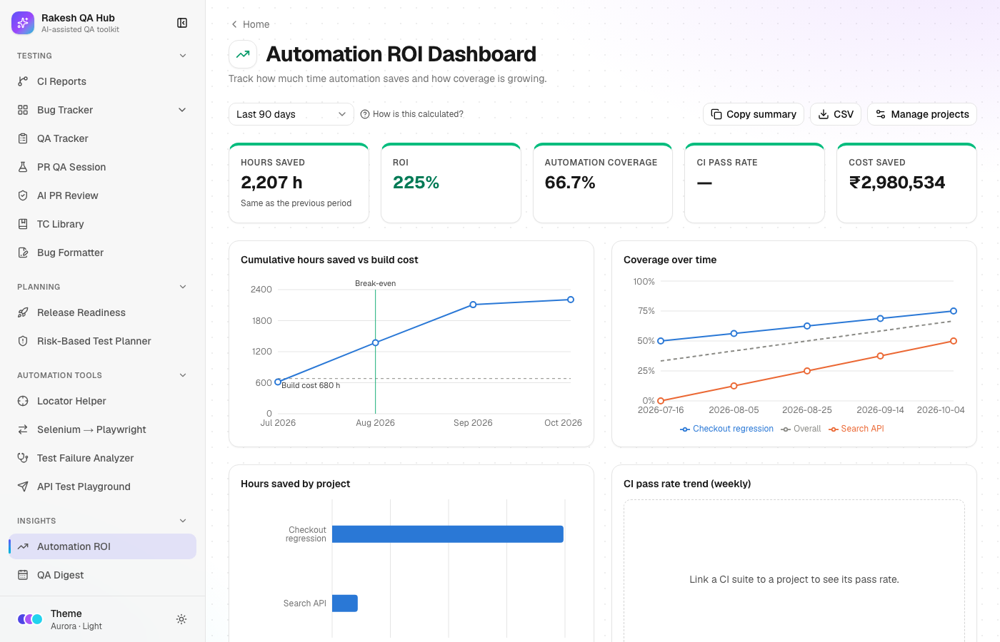

# Rakesh QA Hub

One place for everyday QA work: CI runs, bug and time tracking, PR QA session prompts for Claude Code, AI code-review flags and a test-plan library, plus release readiness, risk-based test planning, locator and Selenium-to-Playwright tools, a test failure analyzer, an API test playground and an automation ROI dashboard. It's a public Next.js app; no login is needed.

**Live:** https://rakesh-qa-hub.vercel.app

| Light | Dark |
|---|---|
|  |  |

**Themes:** pick Light, Dark or System and a colour theme (Aurora, Ocean, Emerald, Sunset or Mono) from the Theme button in the sidebar. The choice is remembered in your browser.

## Modules

The sidebar groups modules the same way as the tables below.

**Test Planning**

| Module | Route | What it does |
|---|---|---|
| Test Case Generator | `/test-case-generator` | Turn a user story, acceptance criteria or an API definition (OpenAPI / cURL) into functional, non-functional and API test cases — with AI, a prompt to paste into Claude, or a rule-based checklist. Edit them in a table and export to Excel, CSV, Markdown, Gherkin or Postman, save to TC Library or send to the API Playground. |
| TC Library | `/tc-library` | Save approved Step 1 + Step 2 outputs (PR analysis and test plan) and reuse them in PR QA sessions. |
| Risk-Based Test Planner | `/risk-planner` | Score areas by likelihood and impact to get a prioritised plan: risk matrix, test depth, hour allocation, deferred "accepted risks", suggestions from Bug Tracker / AI PR Review, Markdown / CSV export and "Send to PR QA Session". |
| Release Readiness | `/release-readiness` | A quality-gate checklist per release with a weighted readiness score and verdict. Gates can auto-check CI Reports, Bug Tracker and AI PR Review. Sign-offs, a Go / No-Go decision with a frozen snapshot, an activity log, a shareable summary and editable templates. |

**Test Execution**

| Module | Route | What it does |
|---|---|---|
| PR QA Session | `/pr-qa-session` | Build a full QA-session prompt for Claude Code from PR URLs, templates, focus areas and steps. |
| API Test Playground | `/api-playground` | A lightweight Postman: requests with params, headers, auth and body, `{{environment}}` variables, assertions, collections, cURL export and history. Requests go through an SSRF-protected proxy. |
| Bug Tracker | `/bug-tracker` | Teams and feature pages with total / valid issues and a % valid pill. Feature issue lists, an activity feed and a workload view. |
| Bug Formatter | `/bug-formatter` | Turn pasted Claude findings, a form or a CSV into Markdown for Jira or Slack. |
| AI PR Review | `/ai-pr-review` | Generate a focused code-review prompt, then log the flags from Claude's table and browse them all. |

**Automation**

| Module | Route | What it does |
|---|---|---|
| CI Reports | `/ci` | Add your own GitHub Actions suites, trigger runs with inputs, follow status, jobs and duration. Optional AI root cause for failed runs. |
| Test Failure Analyzer | `/failure-analyzer` | Paste logs or upload TestNG / JUnit / Playwright reports (or pull a failed CI run) to group failures by likely root cause. Send product bugs to Bug Formatter, mark known flakes, and save analyses to see trends. |
| Locator Helper | `/locator-helper` | Paste HTML, pick an element and get ranked Selenium (Java) and Playwright (TS) locators with robustness scores, a locator tester and Page Object snippets. Runs in the browser; pasted HTML is never rendered. |
| Selenium → Playwright | `/selenium-to-playwright` | Convert Selenium Java tests and page objects to Playwright TypeScript with rule-based conversion, review notes linked to lines, and .ts / .zip download. Optional AI mode, or a prompt to paste into Claude. |
| Test Data Generator | `/test-data-generator` | Design a schema (80 field types, presets) and generate realistic fake data plus edge cases in CSV, TSV, JSON, JSON Lines, Excel, SQL (5 dialects), XML or YAML. Seeded and reproducible, runs in the browser. |

**Reports & Insights**

| Module | Route | What it does |
|---|---|---|
| QA Tracker | `/qa-tracker` | Log daily tasks and hours per person, with charts for the last 7–30 days and a history grouped by date. |
| Automation ROI | `/automation-roi` | Hours saved, ROI, break-even, coverage growth and CI pass rate for the automation projects you add, using real CI runs when linked and estimates otherwise. |

Everything starts empty, except the one generic "Standard release" checklist template. Suites, teams, feature pages, people, releases, plans and projects are added in the app.

### New modules at a glance

| | |
|---|---|
|  |  |
|  |  |
|  |  |
|  | |

### AI features are optional

Without `ANTHROPIC_API_KEY`, AI buttons are hidden and a **Copy prompt for Claude** option takes their place: Locator Helper alternatives, converter AI mode, failure explanations and CI root cause. Every AI feature uses one model constant in `src/config/ai.ts`.

## Tech stack

- Next.js 16 (App Router), React 19, TypeScript, Tailwind CSS 4, shadcn/ui, lucide-react
- next-themes for light/dark mode, plus five colour themes driven by CSS variables
- Prisma 6 with PostgreSQL on Supabase
- zod for validating every API request
- Recharts, PapaParse, react-markdown with remark-gfm
- CodeMirror 6 (code editors), fast-xml-parser (JUnit / TestNG reports), fflate (zip downloads), ipaddr.js (SSRF checks)
- Anthropic SDK for the optional AI features (model set once in `src/config/ai.ts`)
- Vitest for unit tests, Playwright for end-to-end tests
- Deployed on Vercel (functions in Mumbai, `bom1`, next to the database)

## Public-access protection

- Deleting anything, changing CI suites, running workflows, changing a recorded release decision, editing ROI projects and changing the ROI currency need the admin passcode (`x-admin-passcode` header). The app asks for it once per tab.
- Per-IP rate limits: 30 writes per 10 minutes; 5 workflow runs and 10 CI root-cause analyses per hour; 20 Locator Helper and 20 failure-explanation AI calls and 10 AI conversions per hour; 30 API Playground sends per 10 minutes.
- The API Playground proxy only reaches public addresses. Loopback, private, link-local / cloud-metadata, CGNAT, multicast, reserved and IPv6-internal ranges are blocked, and the resolved IP is checked at connect time. Every redirect hop is re-checked. Other limits: 15 s timeout, 2 MB response and 1 MB request caps. Request contents are never logged, and the visitor's cookies are never forwarded.
- Every request body is validated with zod. User content is always escaped, and Markdown is rendered without raw HTML.
- Tokens and keys stay on the server; nothing secret is sent to the browser.

## Local setup

Requirements: Node.js 22+, a PostgreSQL database (Supabase or local).

```bash
git clone https://github.com/RakeshAM03/rakesh_qa_hub.git
cd rakesh_qa_hub
npm install                 # also runs `prisma generate`
cp .env.example .env        # then fill in the values
npx prisma migrate deploy   # create the tables
npm run dev                 # http://localhost:3000
```

Optional generic demo data, for a **local or test database only**:

```bash
ALLOW_DEMO_SEED=1 npm run seed:demo           # adds "Demo Team", "Sample Feature", ...
ALLOW_DEMO_SEED=1 npm run seed:demo -- --reset # removes it again
```

### Environment variables

| Name | Required | Purpose |
|---|---|---|
| `DATABASE_URL` | Yes | Postgres connection used by the app (Supabase transaction pooler, port 6543, `?pgbouncer=true`) |
| `DIRECT_URL` | Yes | Direct Postgres connection used for migrations (port 5432) |
| `ADMIN_PASSCODE` | Yes | Unlocks deletes, CI suite changes and workflow runs |
| `GITHUB_TOKEN` | No | Fine-grained token with Actions read/write on your automation repos. Powers CI Reports, the Release Readiness "CI suite green" gate, Failure Analyzer "From CI" and ROI run counts. Without it those show "Connect GitHub" or fall back to estimates |
| `ANTHROPIC_API_KEY` | No | Turns on the AI features: CI root cause, Locator Helper alternatives, converter AI mode, failure explanations |
| `RCA_DAILY_LIMIT` | No | Max AI root-cause calls per day per server instance (default 50) |

If the database password contains special characters, percent-encode them in both URLs (`@` → `%40`).

## Tests

```bash
npm run lint
npm run typecheck
npm test               # unit tests (Vitest)
npm run e2e            # builds, then runs the Playwright suite against a local test database
```

Unit tests cover every module's core logic (in `src/lib/<module>/`, including the SSRF guard). E2E tests use page objects in `e2e/pages/`. The API Playground's network test only runs with `E2E_NETWORK=1`.

The E2E suite needs a throwaway local Postgres database. It uses `E2E_DATABASE_URL`, or `postgresql://<you>@localhost:5432/qa_hub_test` by default, and empties it before each run. It refuses to touch any non-local database.

To check a deployed site (tests that create data are skipped):

```bash
BASE_URL=https://rakesh-qa-hub.vercel.app npx playwright test
```

GitHub Actions (`.github/workflows/e2e.yml`) runs lint, typecheck, unit tests, the build and the full E2E suite against a Postgres service on every push and pull request. It can also be started by hand with a `base_url` to test a deployment.

## Deployment

The app runs on Vercel (team `rakesh-qa`, project `rakesh-qa-hub`). The production build runs `prisma migrate deploy` before `next build`. Pushes don't deploy automatically yet (the Vercel GitHub app isn't installed), so deploy from the CLI:

```bash
vercel deploy --prod --scope rakesh-qa
```

The specs this app was built from are in [`prompts/`](prompts/). See [`prompts/DEPLOYMENT-GUIDE.md`](prompts/DEPLOYMENT-GUIDE.md) for the full setup guide.
