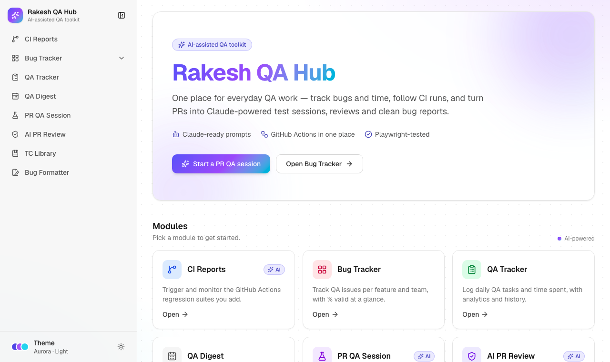
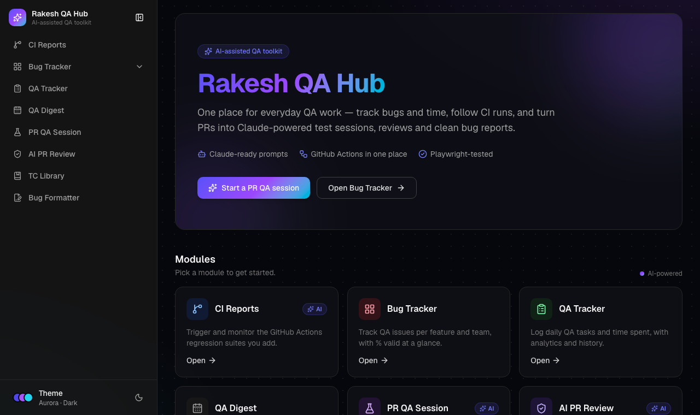

# Rakesh QA Hub

One place for everyday QA work: CI runs, bug tracking, time tracking, PR QA session prompts for Claude Code, AI code-review flags, a test-plan library and a bug-report formatter. It's a public Next.js app; no login is needed.

**Live:** https://rakesh-qa-hub.vercel.app

| Light | Dark |
|---|---|
|  |  |

**Themes:** pick Light, Dark or System and a colour theme (Aurora, Ocean, Emerald, Sunset or Mono) from the Theme button in the sidebar. The choice is remembered in your browser.

## Modules

| Module | Route | What it does |
|---|---|---|
| CI Reports | `/ci` | Add your own GitHub Actions suites, trigger runs with inputs, follow status, jobs and duration. Optional AI root cause for failed runs. |
| Bug Tracker | `/bug-tracker` | Teams and feature pages with total / valid issues and a % valid pill. Feature issue lists, an activity feed and a workload view. |
| QA Tracker | `/qa-tracker` | Log daily tasks and hours per person, with charts for the last 7–30 days and a history grouped by date. |
| QA Digest | `/qa-digest` | Coming soon. |
| PR QA Session | `/pr-qa-session` | Build a full QA-session prompt for Claude Code from PR URLs, templates, focus areas and steps. |
| AI PR Review | `/ai-pr-review` | Generate a focused code-review prompt, then log the flags from Claude's table and browse them all. |
| TC Library | `/tc-library` | Save approved Step 1 + Step 2 outputs (PR analysis and test plan) and reuse them in PR QA sessions. |
| Bug Formatter | `/bug-formatter` | Turn pasted Claude findings, a form or a CSV into Markdown for Jira or Slack. |

Everything starts empty. Suites, teams, feature pages and people are added in the app.

## Tech stack

- Next.js 16 (App Router), React 19, TypeScript, Tailwind CSS 4, shadcn/ui, lucide-react
- next-themes for light/dark mode, plus five colour themes driven by CSS variables
- Prisma 6 with PostgreSQL on Supabase
- zod for validating every API request
- Recharts, PapaParse, react-markdown with remark-gfm
- Anthropic SDK (optional AI root cause in CI Reports)
- Vitest for unit tests, Playwright for end-to-end tests
- Deployed on Vercel (functions in Mumbai, `bom1`, next to the database)

## Public-access protection

- Deleting anything, changing CI suites and running workflows need the admin passcode (`x-admin-passcode` header). The app asks for it once per tab.
- Per-IP rate limits: 30 writes per 10 minutes, 5 workflow runs and 10 AI analyses per hour.
- Every request body is validated with zod. User content is always escaped, and Markdown is rendered without raw HTML.
- Tokens and keys stay on the server; nothing secret is sent to the browser.

## Local setup

Requirements: Node.js 22+, a PostgreSQL database (Supabase or local).

```bash
git clone https://github.com/RakeshAM03/rakesh_qa_hub.git
cd rakesh_qa_hub
npm install                 # also runs `prisma generate`
cp .env.example .env        # then fill in the values
npx prisma migrate deploy   # create the tables
npm run dev                 # http://localhost:3000
```

Optional generic demo data, for a **local or test database only**:

```bash
ALLOW_DEMO_SEED=1 npm run seed:demo           # adds "Demo Team", "Sample Feature", ...
ALLOW_DEMO_SEED=1 npm run seed:demo -- --reset # removes it again
```

### Environment variables

| Name | Required | Purpose |
|---|---|---|
| `DATABASE_URL` | Yes | Postgres connection used by the app (Supabase transaction pooler, port 6543, `?pgbouncer=true`) |
| `DIRECT_URL` | Yes | Direct Postgres connection used for migrations (port 5432) |
| `ADMIN_PASSCODE` | Yes | Unlocks deletes, CI suite changes and workflow runs |
| `GITHUB_TOKEN` | No | Fine-grained token with Actions read/write on your automation repos; without it CI Reports shows "Connect GitHub" |
| `ANTHROPIC_API_KEY` | No | Turns on AI root cause for failed CI runs |
| `RCA_DAILY_LIMIT` | No | Max AI root-cause calls per day per server instance (default 50) |

If the database password contains special characters, percent-encode them in both URLs (`@` → `%40`).

## Tests

```bash
npm run lint
npm run typecheck
npm test               # unit tests (Vitest)
npm run e2e            # builds, then runs the Playwright suite against a local test database
```

The E2E suite needs a throwaway local Postgres database. It uses `E2E_DATABASE_URL`, or `postgresql://<you>@localhost:5432/qa_hub_test` by default, and empties it before each run. It refuses to touch any non-local database.

To check a deployed site (tests that create data are skipped):

```bash
BASE_URL=https://rakesh-qa-hub.vercel.app npx playwright test
```

GitHub Actions (`.github/workflows/e2e.yml`) runs lint, typecheck, unit tests, the build and the full E2E suite against a Postgres service on every push and pull request. It can also be started by hand with a `base_url` to test a deployment.

## Deployment

The app runs on Vercel (team `rakesh-qa`, project `rakesh-qa-hub`). The production build runs `prisma migrate deploy` before `next build`.

```bash
vercel deploy --prod --scope rakesh-qa
```

The specs this app was built from are in [`prompts/`](prompts/). See [`prompts/DEPLOYMENT-GUIDE.md`](prompts/DEPLOYMENT-GUIDE.md) for the full setup guide.
