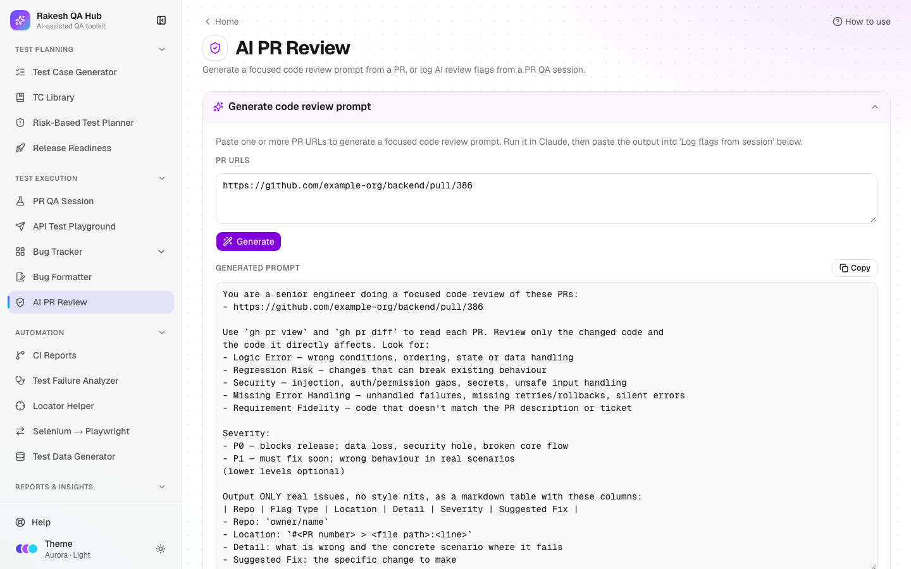

# AI PR Review

**Section:** Test Execution · **Page:** `/ai-pr-review`

## Purpose

AI PR Review has two jobs. First, it generates a focused **code review prompt** for one or more pull requests, which you paste into Claude Code. Second, it lets you **log the flags** Claude finds (logic errors, regression risks, security issues and so on) so the whole team can browse, filter and track them across PRs and repos.

## The problem it solves

**Before:** AI code reviews produce useful findings that vanish when the chat window closes. Nobody can tell which repos keep producing security issues or whether the same logic errors recur, and release decisions can't take review findings into account.

**After:** every review uses the same prompt, so Claude always returns the same table format. Flags are pasted back once and parsed automatically, then stored with repo, type, location (linked to the PR file and line), severity and fix. They show up in filters and in [Release Readiness](release-readiness.md) gates.

## Who should use it and when

- **QA engineers and developers** — when a PR is opened or updated, before merge.
- **QA leads and tech leads** — to spot patterns (e.g. many "Missing Error Handling" flags in one repo) and to check P0 flags before a release.
- **Release managers** — through the "No unresolved P0 review flags" gate in Release Readiness.

## Key features

- **Generate code review prompt** — paste one or more GitHub PR URLs (comma-separated) into **PR URLs** and click **Generate**. Then **Copy** the prompt.
- The prompt tells Claude to use `gh pr view` and `gh pr diff` and to report only real issues in five **flag types**:
  - Logic Error
  - Regression Risk
  - Security
  - Missing Error Handling
  - Requirement Fidelity
- **Log flags from session** with two tabs:
  - **From Claude output** — paste the whole answer, and the flag table is extracted.
  - **Enter manually** — a form with Repo, Flag Type, Location, Severity, Detail and Suggested Fix.
- A preview table where you can fix the type or severity inline, **Edit flag** or remove rows before **Save flags**.
- **All logged flags** — a table with **Date**, **Repo**, **Flag Type**, **Location**, **Detail**, **Severity** and **Suggested Fix**. You can search, filter by type, severity and repo, and set **Rows per page**.
- Locations link straight to the file and line in the PR on GitHub.

## How to use it

1. Open **AI PR Review** from the **Test Execution** section of the sidebar.
2. In **Generate code review prompt**, paste the PR URLs, e.g. `https://github.com/example-org/backend/pull/386`, and click **Generate**.
3. Click **Copy** and paste the prompt into Claude Code in your terminal (with `gh` signed in). Claude replies with a Markdown table.
4. Back in the hub, open **Log flags from session** → **From Claude output** and paste Claude's whole reply into **Paste Claude's output**.
5. Check the preview. Rows shown in red have an unknown flag type or a severity other than P0/P1. Fix them with the inline selects or **Edit flag**, or remove them.
6. Fill **Your name** if you haven't already, then click **Save flags**.
7. Browse **All logged flags**. Filter by repo, type or severity, or search the text. Click a **Location** to open the exact line in the PR.

## Worked example

You generate a prompt for `https://github.com/example-org/backend/pull/386`, and Claude returns:

| Repo | Flag Type | Location | Detail | Severity | Suggested Fix |
|---|---|---|---|---|---|
| example-org/backend | Missing Error Handling | #386 > src/orders/service.ts:88 | Payment gateway timeout is caught and ignored; the order stays "pending" forever | P0 | Mark the order failed and return 502 on timeout |
| example-org/backend | Regression Risk | #386 > src/orders/dto.ts:12 | `discount` renamed to `discountAmount`; the web app still reads `discount` | P1 | Keep `discount` as an alias until the frontend is updated |

You paste the reply into **From Claude output**. Both rows appear in the preview with no red cells, and you click **Save flags**. They show up in **All logged flags** with today's date. Because one is P0, a release linked to `example-org/backend` now fails its "No unresolved P0 review flags" gate.

## Understanding the output

- **Date** — when the flag was logged, shown as MM/DD/YYYY.
- **Flag Type:**
  - **Logic Error** — wrong conditions, ordering or state.
  - **Regression Risk** — may break existing behaviour.
  - **Security** — injection, permission gaps, secrets.
  - **Missing Error Handling** — silent or unhandled failures.
  - **Requirement Fidelity** — the code doesn't match the PR description or ticket.
- **Severity:**
  - **P0** — blocks the release: data loss, a security hole or a broken core flow.
  - **P1** — must fix soon: wrong behaviour in real scenarios.

  Only P0 and P1 are stored.
- **Location** — `#<PR number> > <file path>:<line>`, linked to the PR's file diff on GitHub.
- **Red preview rows** — must be fixed or removed before saving.

## Tips and best practices

- Always use the generated prompt; the table format is what makes pasting back automatic.
- Review several related PRs in one prompt (frontend + backend) so Claude can spot cross-repo regressions.
- Keep the flag text specific: a failing scenario and a concrete fix. It doubles as a bug description.
- Use the repo filter before a release to check for open P0 flags.
- Don't log style nits. The tool is meant for issues that matter.

## Limitations and things to know

- The hub doesn't run the review itself. Claude Code does, on your machine, with your `gh` access.
- Only P0 and P1 flags can be saved. Lower severities are optional in the prompt and are rejected in the preview.
- Flags have no "resolved" state. The release gate looks at P0 flags logged in the last 14 days.
- Editing a flag is open to everyone; deleting one needs the admin passcode.
- Flags are visible to everyone. Keep client data out of the Detail text.

## Works well with

- [PR QA Session](pr-qa-session.md) — its Step 1 "AI Code Quality Review" table uses the same columns, so you can log those flags here too.
- [Release Readiness](release-readiness.md) — linked repos feed the "No unresolved P0 review flags" gate.
- [Risk-Based Test Planner](risk-planner.md) — P0/P1 flags in the last 30 days suggest higher complexity for a plan's areas.
- [Bug Formatter](bug-formatter.md) — turn a serious flag into a bug report for Jira.

## FAQ

**Why does it say "No flag table found"?**
The pasted text needs a Markdown table with at least **Flag Type**, **Detail** and **Severity** columns. Use the generated prompt so Claude produces it.

**Can I log a flag I found myself?**
Yes. Use the **Enter manually** tab.

**How do I remove a wrong flag?**
Click the delete icon in **All logged flags** and enter the admin passcode.

**Does this send my code anywhere?**
No. The hub only builds the prompt text and stores the flags you paste. Claude Code reads the PR on your machine.
