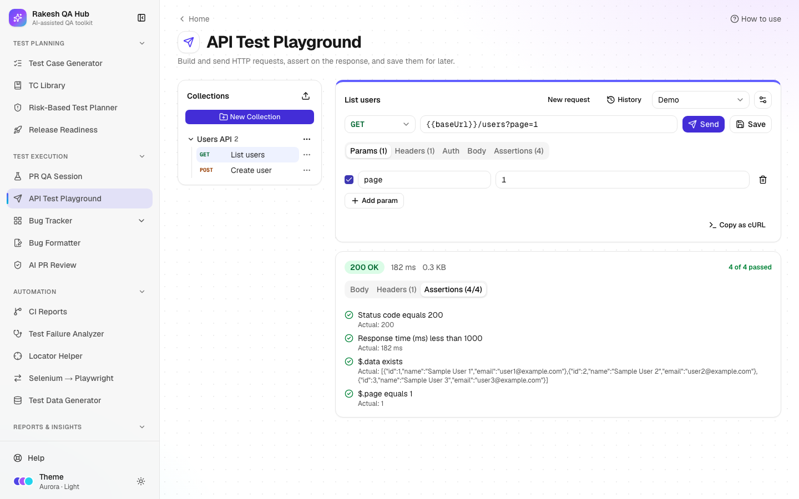

# API Test Playground

**Section:** Test Execution · **Page:** `/api-playground`

## Purpose

The API Test Playground is a lightweight tool for sending HTTP requests to an API and checking the responses, similar to Postman but in the browser. You build a request (method, URL, parameters, headers, authentication and body), send it, and add **assertions**: automatic checks such as "status code equals 200" that pass or fail on every response. Useful requests are saved in shared collections.

## The problem it solves

**Before:** checking an API means installing a desktop tool, sharing exported files back and forth, or writing one-off cURL commands that nobody else can find. Response checks are done by eye, so a wrong status code or a missing field slips through.

**After:** anyone on the team opens a browser tab, picks a saved request, switches the environment from QA to staging, and clicks **Send**. The assertions show a clear Passed / Failed result every time.

## Who should use it and when

- **QA engineers** — to explore and verify endpoints while testing a feature, or to reproduce an API bug.
- **Developers** — to try an endpoint quickly or share a reproducible request in a bug report (**Copy as cURL**).
- **QA leads** — to keep a shared, organised set of smoke requests per service.

## Key features

- Request builder with method, URL and tabs for **Params**, **Headers**, **Auth**, **Body** and **Assertions**.
- **Auth:**
  - **None**
  - **Bearer token**
  - **Basic auth**
  - **API key** — added to a **Header** or to **Query params**.
- **Body:** None, JSON (with **Format** and **Validate**), Form URL-encoded or Raw text.
- **Environments** with variables. Write `{{baseUrl}}` or `{{token}}` anywhere, and unknown variables are shown in red.
- **Assertions:**
  - **Status code**
  - **Response time**
  - **Header**
  - **JSON path**, e.g. `$.data[0].id`
  - **Body text**

  Operators include equals, contains, less than, exists and is type.
- Response viewer with **Body** (a JSON tree with search), **Headers** and **Assertions** tabs, plus status, time and size.
- **Collections** — save, rename, duplicate, **Export JSON** and import.
- **History** of your last 20 requests (kept in your browser), and **Copy as cURL**.
- Keyboard shortcut: **Ctrl/⌘ + Enter** sends the request.

## How to use it

1. Open **API Test Playground** from the **Test Execution** section of the sidebar.
2. Optional: create an environment. Open **Environment** → **Manage environments** → **New environment**, give it a name (e.g. "Staging"), add variables such as `baseUrl = https://api.example.com`, and save.
3. Pick the **Method** (GET, POST…) and type the URL, e.g. `{{baseUrl}}/users`.
4. Add query parameters in **Params** (they sync with the URL) and headers in **Headers**.
5. In **Auth**, pick a type and fill it. Use a variable such as `{{token}}` rather than a real secret.
6. For POST/PUT/PATCH, open **Body**, choose **JSON**, type the body and click **Format** / **Validate**.
7. In **Assertions**, click **Add assertion**. For example: **Status code** equals `200`, and **Response time** less than `1000`.
8. Click **Send** (or press Ctrl/⌘ + Enter). Read the response and the assertion results.
9. Click **Save**. Enter a **Request name**, choose a **Collection** (or **+ New collection…**), and save. It appears in the **Collections** sidebar.

## Worked example

You want a quick smoke check of a public test API.

- **Environment "Demo":** `baseUrl = https://api.example.com`
- **Request:** `GET {{baseUrl}}/users?page=1`
- **Assertions:**
  - Status code equals `200`
  - Response time less than `1000`
  - JSON path `$.data` exists
  - JSON path `$.page` equals `1`

You click **Send**. The response panel shows `200 OK · 182 ms · 1.2 KB`, the JSON body as a tree, and **Assertions (4/4)** with all four checks marked Passed. You save it as "List users" in a new collection "Users API". A teammate later switches the environment to "Staging" and runs the same request against a different base URL, without editing it.

## Understanding the output

- **Status line** — the HTTP status code and text (green for 2xx, blue for 3xx, amber for 4xx, red for 5xx; network errors show a red message instead), the response time and the response size.
- **Body tab** — formatted JSON (expand or collapse nodes, use **Search in body**) or raw text for other content types. **Copy** copies the body.
- **Headers tab** — every response header, with the count in the tab name.
- **Assertions tab** — each check with **Passed** or **Failed**, and the actual value when it fails. The tab title shows passed/total, e.g. `(3/4)`.
- **"The response was larger than 2 MB and has been truncated."** — only the first 2 MB are shown.
- **Unsaved changes** dot — the open request differs from its saved version.

## Tips and best practices

- Put base URLs and tokens in environments, never directly in saved requests. Saved requests are visible to everyone using the hub.
- Add at least a status-code assertion to every saved request so a quick run tells you pass or fail at a glance.
- Use **Copy as cURL** when filing a bug; developers can run the exact request.
- Group requests by service or feature in collections, and use **Export JSON** to back them up.
- Use [Test Case Generator](test-case-generator.md) → **Send to API Playground** to create a whole collection from API test cases.

## Limitations and things to know

- Requests go through the hub's server, which only reaches public internet addresses. Internal hosts such as localhost, private IP ranges and cloud metadata addresses are blocked for security, so you can't test an API that is only on your company network or laptop.
- Limits:
  - 15-second timeout
  - 2 MB response
  - 1 MB request body
  - 30 sends per 10 minutes per user
  - at most 5 redirects, each re-checked
- Your browser cookies are never sent with requests.
- History is stored in your browser only (last 20). Collections and environments are shared with everyone.
- Deleting a collection, request or environment needs the admin passcode.

## Works well with

- [Test Case Generator](test-case-generator.md) — **Send to API Playground** builds a collection with one request per API test case. Relative paths become `{{baseUrl}}/…`.
- [Bug Formatter](bug-formatter.md) — paste the cURL and the response into a bug's steps and actual result.
- [Test Data Generator](test-data-generator.md) — generate JSON bodies (e.g. the "API request body" preset) to paste into **Body**.
- [PR QA Session](pr-qa-session.md) — verify TC-API cases from a session plan by hand.

## FAQ

**Why do I get "blocked" for my localhost API?**
The playground runs requests from the hub's server and blocks private and local addresses on purpose. Use a public test or staging URL.

**Where are my variables stored?**
Environments are saved in the hub and shared with everyone. Don't put real production secrets in them.

**Can I import a Postman collection?**
The playground imports its own collection JSON (`{ name, requests: [...] }`). For Postman, use the Test Case Generator's **Export for Postman** in the other direction.

**What does `{{token}}` in red mean?**
That variable isn't defined in the selected environment. Add it in **Manage environments**, or pick another environment.
