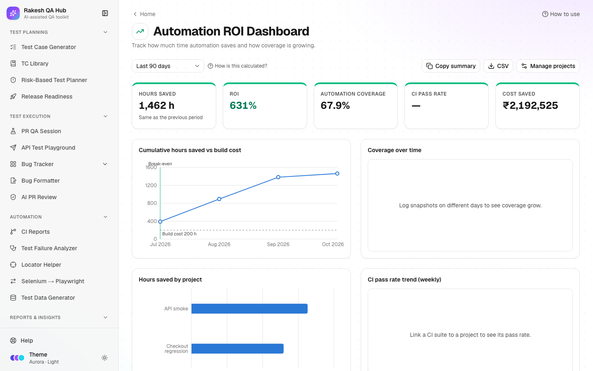

# Automation ROI Dashboard

**Section:** Reports & Insights · **Page:** `/automation-roi`

## Purpose

The Automation ROI Dashboard shows how much time and money your test automation saves compared with running the same tests by hand. **ROI** (return on investment) compares what you gained with what it cost. You add each automation project with a few numbers; the dashboard calculates the following, using real CI runs when a project is linked to a suite:

- hours saved
- ROI %
- break-even point
- coverage growth
- CI pass rate

## The problem it solves

**Before:** when someone asks "is our automation worth it?", the answer is a rough guess. Build and maintenance effort is invisible, the hours saved are never counted, and coverage progress lives in a slide updated once a quarter.

**After:** for each project and in total, you can see the hours of manual testing avoided, minus execution and maintenance time, against the cost of building it. You see when the project paid for itself, how automation coverage is growing, and how stable the CI runs are, all in one shareable view.

## Who should use it and when

- **QA leads and automation leads** — monthly or quarterly, to report value and decide where to invest next.
- **Managers** — to justify automation work, or to see which projects aren't paying off yet.
- **Automation engineers** — to log coverage snapshots as they automate more tests.

## Key features

- **Add project** with:
  - **Name** and an optional **Linked CI suite**
  - **Total test cases** and **Automated test cases**
  - **Avg manual time per test (min)** and **Avg automated time per test (sec)**
  - **Runs per month (estimate)**
  - **Build cost (hours)** and **Maintenance (hours/month)**
  - optional **Hourly cost**
- **Period** — Last 30 days, Last 90 days, This year or Custom.
- **Key figures:**
  - **Hours saved**
  - **ROI**
  - **Automation coverage**
  - **CI pass rate**
  - **Cost saved** — when an hourly cost is set.

  Each shows ↑/↓ against the previous period.
- **Charts:**
  - **Cumulative hours saved vs build cost**, with a break-even marker
  - **Coverage over time**
  - **Hours saved by project**
  - **CI pass rate trend (weekly)**
- A sortable **Projects** table: Project, Coverage, Runs, Hours saved, ROI, Break-even and Pass rate.
- **Snapshot** — log **Total test cases** and **Automated** today, to track coverage over time.
- **Copy summary**, **CSV**, **Manage projects**, **How is this calculated?** and the currency symbol.

## How to use it

1. Open **Automation ROI** from the **Reports & Insights** section of the sidebar.
2. Click **Add project**. Enter a **Name** (e.g. "Checkout regression").
3. Optional: pick a **Linked CI suite** from [CI Reports](ci.md) to use real run counts and durations.
4. Fill **Total test cases**, **Automated test cases**, **Avg manual time per test (min)** and **Build cost (hours)**. These are required.
5. If no CI suite is linked, also fill **Avg automated time per test (sec)** and **Runs per month (estimate)**. Add **Maintenance (hours/month)** and, if you want money figures, **Hourly cost**.
6. Save. Creating a project also logs its first coverage snapshot.
7. Choose a **Period** and read the key figures and charts.
8. As you automate more tests, click **Snapshot** on the project, update **Total test cases** and **Automated**, and click **Log snapshot**.
9. Share with **Copy summary** (text) or **CSV**.

## Worked example

Project "Checkout regression", not linked to CI:

- **Total test cases:** 200 · **Automated test cases:** 120 → coverage 60%
- **Avg manual time per test:** 6 min · **Avg automated time per test:** 20 sec
- **Runs per month:** 20
- **Build cost:** 160 h · **Maintenance:** 8 h/month

For **Last 90 days** (about 2.96 months):

- **Runs** ≈ 59.
- **Manual effort avoided** ≈ 59 × 120 × 6 ÷ 60 ≈ 710 h.
- **Execution time** ≈ 59 × 120 × 20 ÷ 3,600 ≈ 39 h.
- **Maintenance** ≈ 24 h.
- **Net hours saved** ≈ 647 h.
- **ROI %** = (647 − 160) ÷ 160 × 100 ≈ 304%.

**Break-even** is reached in the first month of the period. The project shows a "Using estimates" badge because it isn't linked to CI.

## Understanding the output

- **Runs** — real CI runs in the period (linked) or runs per month × months (estimate).
- **Manual effort avoided (h)** — runs × automated tests × manual minutes ÷ 60.
- **Execution time (h)** — real CI durations (linked) or runs × automated tests × seconds ÷ 3,600.
- **Net hours saved** — manual effort avoided − execution − maintenance.
- **ROI %** — (cumulative net hours − build cost) ÷ build cost × 100. A negative value means the project hasn't paid back its build cost yet in this period.
- **Break-even** — the month in which cumulative net hours passed the build cost, or "Not yet".
- **Automation coverage** — automated ÷ total test cases, weighted across projects.
- **CI pass rate** — successful runs ÷ completed runs (linked projects only), shown weekly in the trend chart.
- **↑ / ↓** — the change against the previous period of the same length. "Same as the previous period" means no change.
- **Using estimates** — the project isn't linked to CI, or GitHub isn't connected, so the manual estimates are used.

## Tips and best practices

- Link projects to CI suites whenever you can; real runs and durations make the numbers credible.
- Be honest about **Build cost** and **Maintenance**. Underestimating them inflates ROI and hurts trust in the report.
- Log a **Snapshot** whenever coverage changes noticeably, at least monthly, so the coverage chart tells a story.
- Use **This year** for management reports and **Last 30 days** for team check-ins.
- Read the **CI pass rate** together with ROI. A suite that fails often costs more in investigation time than the numbers show.

## Limitations and things to know

- Real CI data needs `GITHUB_TOKEN` set by the hub owner. Without it, linked projects fall back to estimates and the page says "Using estimates".
- CI data is capped at 1,000 runs per suite per period.
- ROI, cumulative net and break-even are calculated over the selected period only, not since the project started.
- Only one snapshot is kept per day; logging again the same day replaces it.
- Editing or deleting a project and changing the currency need the admin passcode. Creating projects and logging snapshots don't.
- The dashboard measures time saved on repeated test runs, not quality benefits such as earlier bug detection.

## Works well with

- [CI Reports](ci.md) — link a project to a suite for real run counts, durations and pass rates.
- [Selenium → Playwright Converter](selenium-to-playwright.md) — track the payoff of a migrated suite as a project.
- [QA Tracker](qa-tracker.md) — compare manual effort logged with the time automation saves.
- [Release Readiness](release-readiness.md) — the same CI suites feed the "CI suite green" gate.

## FAQ

**Why is ROI negative?**
In the selected period, net hours saved haven't yet covered the build cost. Pick a longer period, or check that runs per month and manual times are realistic.

**What if I don't know the exact manual time per test?**
Time a few typical manual tests and use the average. You can edit the project later (passcode needed).

**Can I show money instead of hours?**
Yes. Set **Hourly cost** on projects; **Cost saved** then appears. Change the currency symbol in **Manage projects** (passcode needed).

**Does linking a CI suite change past numbers?**
Yes. Linked projects use real runs for any period you pick, replacing the estimates.
