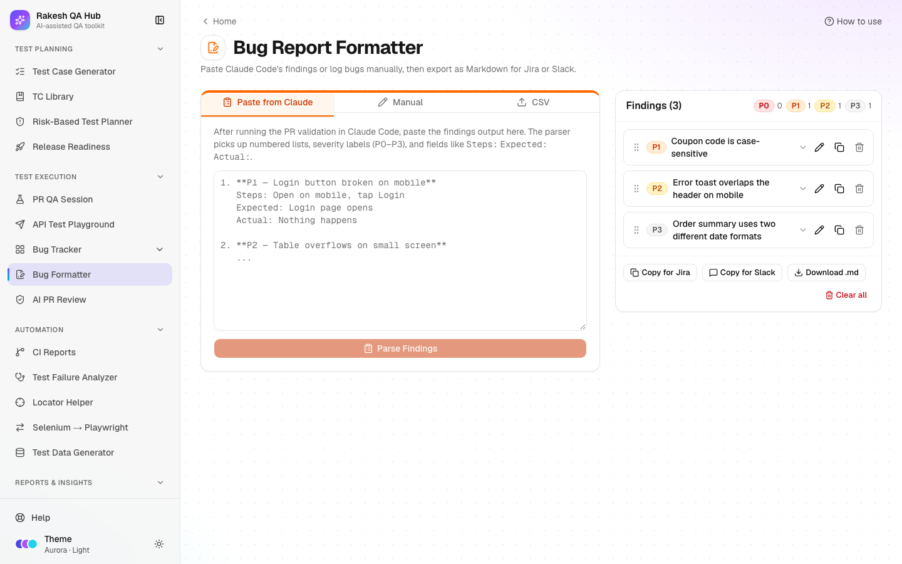

# Bug Formatter

**Section:** Test Execution · **Page:** `/bug-formatter`

## Purpose

The Bug Formatter (its page title is "Bug Report Formatter") turns rough findings into clean, consistent bug reports. You can paste Claude Code's findings, fill a short form, or upload a CSV file. The bugs are listed by severity, and you export them as Jira-formatted text, Slack-ready text or a Markdown file.

## The problem it solves

**Before:** findings from a test session come out as a long block of text. Turning them into proper bug reports means copying titles, steps, expected and actual results into a ticket by hand, one by one, in a slightly different format each time.

**After:** paste the findings once and they are split into separate bugs with severity, steps, expected and actual results. Reorder them, fix any detail, and copy everything at once for Jira or Slack.

## Who should use it and when

- **QA engineers** — at the end of a test session (for example Step 7 of a [PR QA Session](pr-qa-session.md)), before filing tickets or posting a summary.
- **QA leads** — to post a daily or end-of-cycle bug summary to the team channel.
- **Anyone** — to write a single well-structured bug report quickly with the **Manual** form.

## Key features

- Three ways to add bugs:
  - **Paste from Claude** — understands numbered lists, severity labels (P0–P3) and `Steps:`, `Expected:` and `Actual:` lines.
  - **Manual** — a form with **Title**, **Severity**, **Environment URL**, **Steps to reproduce**, **Expected result**, **Actual result** and **Notes**.
  - **CSV** — needs a `Title` column. `Severity`, `Steps`, `Expected`, `Actual`, `Environment` and `Notes` are optional, and a **Template** file is available.
- New bugs are placed by severity. Drag the handle (or use arrow keys on it) to reorder.
- **Edit**, **Copy** (one bug) or delete any bug using the icons on its card.
- A count of bugs by severity.
- Exports: **Copy for Jira** (Jira wiki markup), **Copy for Slack** and **Download .md**.
- **Clear all**, with a confirmation.
- Can be pre-filled from the [Test Failure Analyzer](failure-analyzer.md) (**Send to Bug Formatter**).

## How to use it



1. Open **Bug Formatter** from the **Test Execution** section of the sidebar.
2. Choose a tab:
   - **Paste from Claude** — paste the findings into the box and click **Parse Findings**.
   - **Manual** — fill **Title** (required) and the other fields, then click **Add Bug**.
   - **CSV** — click **Click to select a CSV file** or drag one in. Use **Template** if you need the column layout.
3. Check the list. Click the pencil (**Edit**) icon on a bug to fix wording or add missing details, then **Save changes**.
4. Drag bugs into the order you want to report them.
5. Export:
   - **Copy for Jira** — paste into a Jira description or comment.
   - **Copy for Slack** — paste into a channel.
   - **Download .md** — save a Markdown file.
6. When you're done, **Clear all** empties the list (you'll be asked to confirm).

## Worked example

You paste these findings from a Checkout test session:

```
1. **P1 — Coupon code is case-sensitive**
   Steps: Open checkout, enter coupon "save10", apply
   Expected: Coupon SAVE10 is applied
   Actual: "Invalid coupon" error

2. **P2 — Error toast overlaps the header on mobile**
   Steps: Open checkout on a 375px screen, submit an empty form
   Expected: Toast appears below the header
   Actual: Toast covers the header and the back button
```

After **Parse Findings**, two bugs appear. The counts show one P1 and one P2. Each bug card shows its severity badge, title, numbered steps and expected/actual results. **Copy for Slack** gives a tidy message with bold titles and bullet steps. **Copy for Jira** gives text with `h2. [P1] …` headings, a bold *Steps to Reproduce* label and `#` numbered steps that Jira renders properly.

## Understanding the output

- **Severity badges:**
  - **P0** (red) — critical: a blocker, data loss or security.
  - **P1** (orange) — high.
  - **P2** (amber) — medium.
  - **P3** (grey) — low.
- **Bug card** — shows the environment, steps, expected, actual and notes. "No details yet. Use Edit to add steps and results." means only a title was found.
- **Jira export** — uses Jira wiki markup (headings, numbered lists, bold labels).
- **Slack export** — uses Slack formatting, with special characters escaped so they display correctly.
- **.md download** — a Markdown document with one section per bug, in list order.

## Tips and best practices

- Ask Claude to write findings as a numbered list with `P0`–`P3` and `Steps:` / `Expected:` / `Actual:` lines. That's exactly what the parser reads.
- Steps can be on one line separated by commas, semicolons or arrows (`>`, `->`, `→`); they are split into numbered steps.
- Put the environment URL on every bug; developers need it to reproduce.
- Order bugs by impact before posting. Readers often stop after the first few.
- Use the CSV tab to bulk-import bugs exported from a spreadsheet.

## Limitations and things to know

- Bugs are stored **only in your browser** (local storage). They aren't shared with teammates and are lost if you clear your browser data. Export before switching computers.
- **Clear all** doesn't need a passcode, because the data is only yours.
- The parser handles common formats. Unusual text may need a quick **Edit** after parsing.
- The formatter doesn't create Jira tickets for you; it gives you text to paste.
- Don't paste client data or credentials into bug text; exports go wherever you paste them.

## Works well with

- [PR QA Session](pr-qa-session.md) — paste Claude's Step 7 findings here.
- [Test Failure Analyzer](failure-analyzer.md) — **Send to Bug Formatter** opens the **Manual** tab pre-filled from a failure cluster that looks like a product bug.
- [Bug Tracker](bug-tracker.md) — log the formatted bugs there to track their status and valid rate.
- [API Test Playground](api-playground.md) — use **Copy as cURL** for exact reproduction steps.

## FAQ

**Why did Parse Findings say "No findings found"?**
The text needs a numbered list, e.g. "1. P1 — Title". Add numbers, or add the bug with the **Manual** tab.

**Can my teammates see my bugs?**
No. The list lives in your browser only. Share it with **Copy for Slack** or **Download .md**.

**Can I change the order after export?**
Yes. Drag bugs into a new order and copy again; exports always follow the current list order.

**What CSV columns are required?**
Only `Title`. `Severity`, `Steps`, `Expected`, `Actual`, `Environment` and `Notes` are optional. Download the **Template** to start.
