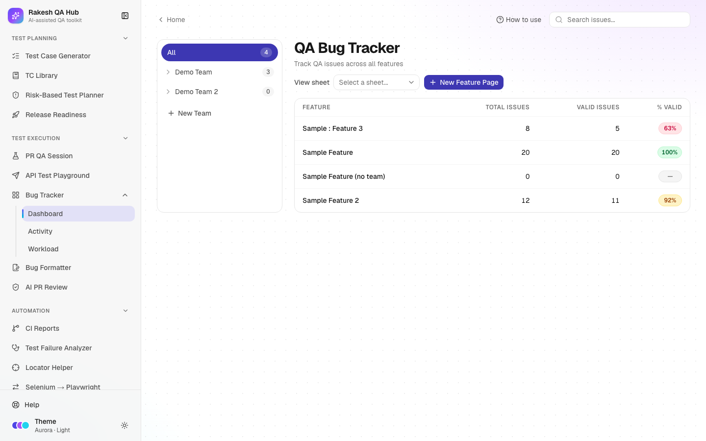

# Bug Tracker

**Section:** Test Execution · **Pages:** `/bug-tracker` (Dashboard), `/bug-tracker/activity` (Activity), `/bug-tracker/workload` (Workload)

## Purpose

The Bug Tracker is a simple place to log QA issues per feature and team. It shows how many issues each feature has and what share of them are **valid**. A valid issue is a real defect, as opposed to a duplicate, a misunderstanding or "works as designed". It has three views: the **Dashboard** (features and their numbers), **Activity** (a feed of every change) and **Workload** (open and closed issues per person).

## The problem it solves

**Before:** issues found during a test cycle are scattered across chat messages and spreadsheets. Nobody knows how many are open per feature, how many were later rejected as invalid, or who is overloaded.

**After:** every issue sits under its feature page with a severity, status and assignee. The dashboard's **% Valid** pill shows report quality at a glance, Activity shows what changed and when, and Workload helps balance the team.

## Who should use it and when

- **QA engineers** — during a test cycle, to log issues as they find them and update their status.
- **QA leads** — daily, to watch open P0/P1 issues, the valid rate per feature and the team's workload.
- **Developers** — to see the issues assigned to them and mark them Resolved.
- **Managers** — before a release, to see defect counts per feature (they also feed [Release Readiness](release-readiness.md)).

## Key features

- **Teams** (**+ New Team**) that group **feature pages** (**New Feature Page**). Use the team list on the left to filter, or **All** to see everything.
- A dashboard table with **Feature**, **Total issues**, **Valid issues** and **% Valid** per feature page.
- Feature pages with an issue table: **ID**, **Title**, **Severity**, **Status**, **Valid**, **Reporter**, **Assignee**, **Created** and **Actions**.
- **New Issue** dialog: **Title**, **Description**, **Severity** (P0–P3), **Status** (Open, In Progress, Resolved, Closed), **Reporter**, **Assignee** and a **Valid issue** switch.
- Inline status changes and a valid switch right in the table.
- **Search issues...** across all features, from any Bug Tracker page.
- **Activity** — a newest-first feed of issue changes, such as "changed status from Open to Resolved".
- **Workload** — per-assignee counts of open, open P0/P1 and closed valid issues, with an open-vs-closed bar.

## How to use it

1. Open **Bug Tracker** from the **Test Execution** section of the sidebar. The **Dashboard** opens.
2. Click **+ New Team** and enter a **Team name** (e.g. "Payments").
3. Click **New Feature Page**, enter a **Feature Name** (e.g. "Checkout") and choose the **Team**.
4. Click the feature in the table to open its page, then click **New Issue** (or **Add the first issue**).
5. Fill **Title** and **Description**, pick a **Severity** and **Status**, and set the **Assignee**. **Reporter** is pre-filled with your **Your name** value (set in modules such as TC Library or Release Readiness; it's shared across the hub in this browser). Leave **Valid issue** on unless the issue was rejected.
6. Save. The issue appears in the table, and the dashboard counts update.
7. As work progresses, change **Status** inline (e.g. Open → In Progress → Resolved). Turn **Valid** off if an issue turns out not to be a defect.
8. Open **Activity** in the sidebar (under Bug Tracker) to see every change across features.
9. Open **Workload** to see how many valid issues each assignee has open and closed.

## Worked example

Team "Payments" has a feature page "Checkout". During a test cycle you log four issues:

| Title | Severity | Status | Valid |
|---|---|---|---|
| Coupon code is case-sensitive | P1 | Open | ✓ |
| Total not updated after removing an item | P0 | In Progress | ✓ |
| Button colour differs from design | P3 | Closed | ✗ (works as designed) |
| Error toast overlaps the header on mobile | P2 | Resolved | ✓ |

The dashboard shows **Checkout: Total issues 4, Valid issues 3, % Valid 75%** with a red pill. **Workload** shows "Demo Assignee A: Open 2, Open P0/P1 2, Closed 1". **Activity** lists "changed status from Open to Resolved on Error toast overlaps the header on mobile".

## Understanding the output

- **% Valid pill** — valid issues ÷ total issues:
  - **Green** — 95% or more.
  - **Amber** — 85–94%.
  - **Red / pink** — below 85%.
  - **Grey "—"** — no issues yet.

  A low rate can mean unclear requirements or reports that need more detail.
- **Severity:**
  - **P0** — critical: a blocker, data loss or security.
  - **P1** — high: a major feature broken.
  - **P2** — medium.
  - **P3** — low or cosmetic.
- **Status** — Open (new), In Progress (being fixed), Resolved (fixed, waiting for QA to confirm) and Closed (done).
- **ID** — the last 6 characters of the issue's internal ID, unique enough to quote in conversations.
- **Workload counts** — only valid issues count. Open = Open + In Progress, and Closed = Resolved + Closed. **Open P0/P1** highlights urgent work, and **Unassigned** collects issues with no assignee.
- **Activity entries** — who changed what (the actor is the **Your name** value), from which value to which, and when.

## Tips and best practices

- Agree on what P0–P3 mean in your team and stick to it; release gates count P0 and P1 issues.
- Mark rejected issues invalid instead of deleting them. The % Valid rate is a useful signal about report quality.
- Set **Your name** once (it's on the TC Library, AI PR Review, Release Readiness and Failure Analyzer pages and shared across the hub) so the reporter and activity show who did what.
- Use one feature page per user-facing feature (e.g. "Checkout", "Login") rather than per sprint, so history builds up.
- Check **Workload** before assigning new bugs.

## Limitations and things to know

- This is a lightweight tracker, not a replacement for Jira or similar tools. There are no attachments, comments, or custom fields.
- **View sheet** (Google Sheets sync) is shown as "Coming soon".
- Deleting an issue or a feature page needs the admin passcode, and deleting a feature page also deletes its issues.
- Team and feature names must be unique (ignoring upper/lower case).
- Everything is visible to everyone using the hub. Don't log client data or personal details in issue text.

## Works well with

- [Bug Formatter](bug-formatter.md) — format findings cleanly, then log the important ones here.
- [Release Readiness](release-readiness.md) — linked feature pages feed the "No open P0 bugs", "No open P1 bugs" and "Valid-bug rate" gates.
- [Risk-Based Test Planner](risk-planner.md) — import feature pages as plan areas and get defect-history suggestions.
- [Test Failure Analyzer](failure-analyzer.md) — failures that look like product bugs can go through the Bug Formatter and end up here.

## FAQ

**What's the difference between Resolved and Closed?**
Resolved means a developer says it's fixed. Closed means QA has confirmed it, or it was decided not to fix it.

**Why doesn't an issue appear in Workload?**
Workload counts valid issues only. Check that **Valid issue** is on and an assignee is set; issues without an assignee are under "Unassigned".

**Can I move an issue to another feature?**
Not directly. Create it on the right feature page and delete the old one (passcode needed).

**How do I find an issue quickly?**
Use **Search issues...** at the top of any Bug Tracker page. Clicking a result opens its feature page with the issue highlighted.
