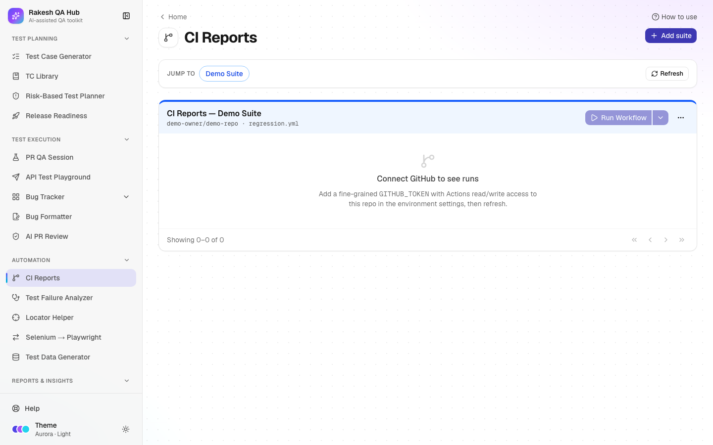

# CI Reports

**Section:** Automation · **Page:** `/ci`

## Purpose

CI Reports is a dashboard for your automated test suites running on **GitHub Actions**, GitHub's built-in CI (continuous integration) service. You add each suite once by pointing at a repository and a workflow file. From then on you can start runs with the right inputs, follow their status, jobs and duration, and open their reports without digging through GitHub.

## The problem it solves

**Before:** to run the regression suite, testers need access to the right repo and must remember which workflow, branch and inputs to use. Checking results means clicking through several GitHub pages, and failures are investigated from raw logs.

**After:** every team suite is listed on one page. **Run Workflow** asks for exactly the inputs the suite needs, and runs refresh automatically while in progress. Each run shows its conclusion, jobs, report link and, when AI is on, a short root-cause summary of what failed.

## Who should use it and when

- **QA engineers** — to trigger a regression or smoke run on a branch or environment, and to check results.
- **QA leads** — to watch suite health before a release and spot repeated failures.
- **Developers** — to confirm their branch passes the team's suites before merging.

## Key features

- **Add suite** with:
  - **Display name**
  - **GitHub repo** (`owner/name`)
  - **Workflow file**, e.g. `regression.yml`
  - **Colour**
  - optional **Dispatch inputs** (text or choice) that your workflow's `workflow_dispatch` accepts
- **Run Workflow** — choose a **Branch** (or the default branch) and fill the inputs.
- A runs table per suite with **Run**, **Status**, **Report**, **Conclusion**, **Jobs**, **Root cause**, **Trigger**, **Duration**, **Started** and **Actor**, with paging.
- Automatic refresh every 20 seconds while a run is queued or in progress, plus a **Refresh** button.
- **Analyse** a failed run for an AI root-cause summary (when AI is on).
- **Jump to** a suite, and **Edit**, **Move up**, **Move down** or **Delete** a suite.

## How to use it

1. Open **CI Reports** from the **Automation** section of the sidebar.
2. Click **Add suite** (or **No CI suites yet — add your first one**).
3. Fill **Display name** (e.g. "Checkout regression"), **GitHub repo** (e.g. `example-org/qa-automation`) and **Workflow file** (e.g. `regression.yml`). Pick a **Colour**.
4. If the workflow takes inputs, click **Add input** under **Dispatch inputs** for each one. Use **Text**, or **Choice** with comma-separated options such as `qa, staging`, and an optional default.
5. Save. You'll be asked for the admin passcode. When a GitHub token is configured, the hub checks that the repo and workflow exist.
6. To start a run, click **Run Workflow** on the suite. Pick a **Branch** (leave it empty for the default), fill the inputs, and confirm (passcode needed).
7. Watch the new run appear in the table. Its status updates by itself.
8. When it finishes, click **Report** to open the run's artifacts on GitHub. For a failed run, click **Analyse** for a root-cause summary if AI is on.

## Worked example

Your team has a workflow `regression.yml` in `example-org/qa-automation` with an input `environment` (choice: `qa`, `staging`).

You add the suite "Checkout regression" with a **Choice** input `environment` (options `qa, staging`, default `qa`). You click **Run Workflow**, leave the branch empty, choose `staging` and confirm. The run appears with Status "queued", then "in progress". Fourteen minutes later it shows **Conclusion: failure**, **Jobs: 3/4**, **Duration: 14m 02s** and **Actor: your GitHub user**. You click **Analyse**, and the root-cause column shows something like "Login step timed out waiting for the SSO page; likely environment slowness, not a product change". You confirm it against the logs before acting.

## Understanding the output

- **Run** — the run number, linked to GitHub.
- **Status** — queued, in progress or completed.
- **Conclusion** — success (green), failure (red), cancelled or skipped (grey).
- **Report** — opens the run's artifacts section on GitHub (for example an HTML test report uploaded by the workflow).
- **Jobs** — passed/total jobs, e.g. `3/4`. Click it to see each job and its result.
- **Root cause** — an AI summary of the failed job logs ("—" when AI is off or not yet analysed). Always check it against the logs before acting.
- **Trigger** — the GitHub event that started the run, e.g. `workflow_dispatch` (started from here or by hand), `push` or `schedule`.
- **Duration**, **Started**, **Actor** — how long the run took, when it began (hover for the exact time) and the GitHub user who started it.
- **"Connect GitHub to see runs"** — the hub has no GitHub token yet; see the limitations below.

## Tips and best practices

- Add one suite per workflow your team actually runs. Use **Move up** / **Move down** to put the most important at the top.
- Define **Dispatch inputs** with **Choice** wherever possible, so people can't mistype an environment name.
- Ask your workflow to upload its HTML report as an artifact, so **Report** opens something useful.
- Use AI root cause as a starting point, then confirm in the [Test Failure Analyzer](failure-analyzer.md) with **From CI**.
- Link suites to releases in [Release Readiness](release-readiness.md) so the "CI suite green" gate checks them automatically.

## Limitations and things to know

- Runs, jobs and dispatch need the hub owner to set `GITHUB_TOKEN`, a fine-grained GitHub token with Actions read/write access to your repos. Without it, suites are listed but show "Connect GitHub to see runs".
- Adding, editing, moving or deleting suites and starting runs need the admin passcode.
- Run limits: 5 workflow runs and 10 AI root-cause analyses per hour per user, and an AI daily cap per server.
- Root cause only works when AI is turned on. Otherwise the column shows "—".
- Deleting a suite only removes it from this page; the workflow and its runs on GitHub aren't touched.

## Works well with

- [Test Failure Analyzer](failure-analyzer.md) — **From CI** pulls a failed run's logs and groups the failures by root cause.
- [Release Readiness](release-readiness.md) — the "CI suite green" gate checks the latest completed run of linked suites.
- [Automation ROI](automation-roi.md) — link a project to a suite to use real run counts and durations.
- [Locator Helper](locator-helper.md) — fix the broken locators that cause many failures.

## FAQ

**Why can't I see any runs?**
Either no GitHub token is configured ("Connect GitHub to see runs"), or the workflow has never run. Click **Run Workflow** to start the first one.

**My workflow doesn't show the inputs I added.**
The inputs in the hub must match the `workflow_dispatch` inputs in your workflow file. The hub only sends the inputs you define.

**Can I cancel a run from here?**
No. Open the run on GitHub (click the run number) and cancel it there.

**Who can run workflows?**
Anyone who knows the admin passcode. This stops random visitors from starting expensive runs.
