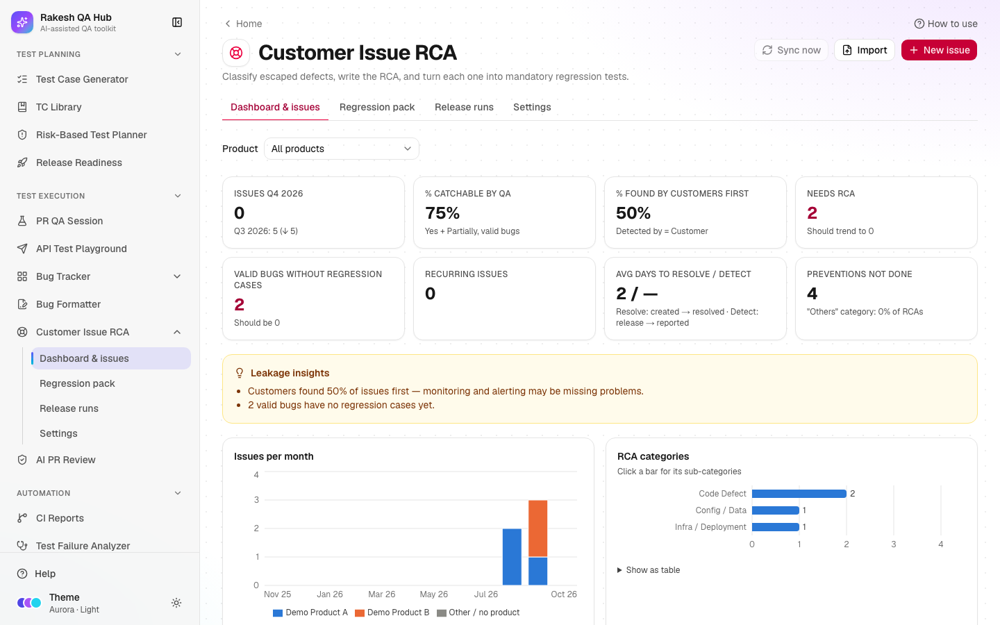

# Customer Issue RCA

**Section:** Test Execution · **Pages:** `/customer-issues` (dashboard & issues), `/customer-issues/pack`, `/customer-issues/runs`, `/customer-issues/settings`

## Purpose

Customer Issue RCA turns every **escaped defect** — a bug a customer found in production — into a repeatable QA process, so the same issue never escapes again. You pull issues from Jira (or import / add them), classify each one with a disposition, an **RCA** (root cause analysis) category and the stage where it should have been caught, write regression test cases for it, and make those cases **mandatory before every release**. Release Readiness then blocks a release until they pass.

## The problem it solves

**Before:** a customer reports a bug, the team fixes it and writes an RCA in a ticket comment. Nobody adds a test, nobody checks it next release, and three months later the same bug — or its cousin — escapes again. Leadership asks "where does our process leak?" and nobody can answer.

**After:** each customer issue has a structured RCA (category → sub-category, catch stage, catchable by QA, why it escaped), its own regression cases in the mandatory pack, and an execution run per release that must be green before Go. The dashboard shows escapes per product, % catchable and exactly which stage leaks most.

## Who should use it and when

- **QA engineers** — when a customer issue is fixed: classify it, write the RCA with the developer, generate and refine the regression cases; before each release, execute the run.
- **QA leads** — weekly, to clear the **Needs RCA** queue; before releases, to check the run and the Readiness gate.
- **Dev leads and product owners** — to agree the RCA and prevention action, and to see where escapes come from.
- **Managers** — monthly or quarterly, on the dashboard: escapes per quarter, % found by customers first, leakage insights.

## Key features

- **Jira sync** (when connected): JQL query, product mapping, **Sync now** and an optional daily sync. Jira fields refresh; your classification is never overwritten. Optional RCA comment back to Jira.
- **Import** CSV / Excel with column matching and an old "Type" → RCA category mapping step, and **New issue**.
- **Classification:** disposition, two-level RCA category with defaults, caught-at stage, catchable, why it escaped, detected by, scope, impact, severity, recurring, owner team, RCA and prevention (Markdown).
- **RCA completeness** ("7/9 fields"), **Needs RCA** queue and **Mark RCA complete**.
- **Regression test cases** per issue via the Test Case Generator engine (checklist, Claude prompt or AI), IDs `TC_CI_<issue-key>_<NN>`, **Mandatory before release**, **Automated?**, **Save to TC Library**.
- **Regression pack**, **Release runs** (Pass / Fail / Blocked / N/A) and the Release Readiness gate **Customer issue regression pack passed**.
- **Dashboard** with a product filter, KPIs, charts and leakage insights.

## How to use it

1. Open **Customer Issue RCA** from the **Test Execution** section of the sidebar.
2. First time: open **Settings** → **Lists** and add your **Products**. Review the default categories; rename or deactivate anything that doesn't fit (admin passcode).
3. Get issues in: **Settings** → **Jira** (enter a JQL query and product mapping, then **Sync now**), or **Import**, or **New issue**.
4. Click **Needs RCA** and open an issue. Pick the **Disposition**. For a **Valid Bug**, pick the **RCA category** (catchable and owner team pre-fill), the **Sub-category**, **Should have been caught at**, **Catchable by QA?**, **Why it escaped**, **Detected by** and **Severity**, and write the **RCA** and **Prevention action**.
5. Click **Save changes**, then **Mark RCA complete** when the checklist is all green.
6. Under **Regression test cases**, click **Generate test cases** → **Checklist (no AI)** (or the Claude prompt), untick anything you don't want and **Add** them. Edit, mark automation, then **Save to TC Library**.
7. Before a release, open **Release runs** → **New release run**, choose the products and link the Release Readiness release.
8. Execute each case: **Pass**, **Fail**, **Blocked** or **N/A** (with a reason). For a failure, click **Send to Bug Formatter**.
9. When the run is **Complete**, the release's gate turns green. Share the result with **Copy report** or **Export Excel**.

## Worked example

DEMO-103 "Partner sync shows false 'rejected' status" arrives from Jira for Demo Product A. You classify it: **Valid Bug** → **Code Defect** → **Missing null/validation check** (catchable pre-fills **Yes**, owner **Dev**), caught at **Code review / unit tests**, why it escaped **Missing test case**, detected by **Customer**, severity **P2 - High**. RCA: "An empty status from the partner was treated as 'rejected'." Completeness reads 9/9 and you **Mark RCA complete**.

**Checklist (no AI)** proposes 10 cases: TC_CI_DEMO-103_01 "Verify the customer scenario from DEMO-103 no longer fails…", four variants (empty response, null value, partial response, unexpected value), related flows, plus permission and network-drop cases. You add them all.

Next release: run "v2.5.0 regression" includes those 10 cases. One fails → the run is **Blocked** and the release's gate reads "1/10 executed, 1 failed". The fix is redeployed, every case passes, the run is **Complete** and the gate passes.

## Understanding the output

RCA main categories (editable in Settings → Lists):

| Category | Meaning | Default catchable | Default owner |
|---|---|---|---|
| QA Miss | A test existed or was in scope, but QA didn't catch it | Yes | QA |
| QA Skip | Testing was knowingly skipped or reduced | Yes | QA + PM |
| Code Defect | Logic bug in new or changed code | Yes | Dev |
| Code Sync / Release | Merge, branch or release packaging problem | Partially | Dev + DevOps |
| Config / Data | Configuration or data caused the issue | Partially | Dev + Support |
| Infra / Deployment | Servers, deployment, caching, networking | No | DevOps |
| Integration / Third-party | External system behaviour | Partially | Dev + QA |
| Requirement Gap | Built as specified but wrong for the customer | No | PO / BA |
| Design / UX | Design or usability problem | Partially | Design + QA |
| Security | Security weakness | Yes | Dev + QA |
| Others | Nothing else fits — a comment is required | — | — |

- **Dispositions:** Valid Bug (RCA required), Duplicate and Known Issue (linked key required), Not a Bug, Can't Reproduce, User Error (note).
- **Completeness pill:** red = fields missing; amber = all fields filled but not marked complete; green = **RCA complete** (or **Classified** for non-bugs).
- **Run status:** **Blocked** if any case failed or is blocked; **Complete** only when every case is Pass or N/A with a reason.
- **KPIs:** % catchable = Yes + Partially among valid bugs; % found by customers first = Detected by Customer; days to detect = report date − release date of the version that introduced the bug.

## Tips and best practices

- Write the RCA with the developer who fixed it — the sub-category drives which variants get tested.
- Keep "Others" rare; if you use it often, add the missing category in Settings.
- Fill **Prevention action** and track **Prevention status** — the dashboard counts preventions not done.
- Mark cases **Automated?** = Yes with a reference once they're in your suite; the pack shows automated vs manual.
- Link every release run to its Release Readiness release so the gate enforces it.

## Limitations and things to know

- Jira needs the hub owner to set `JIRA_BASE_URL`, `JIRA_EMAIL` and `JIRA_API_TOKEN` (server only). Without them: "Jira not connected — use CSV import or add issues manually". Scheduled sync also needs `CRON_SECRET` and runs once a day.
- **Sync now** is limited to 5 per hour. Imports take up to 2,000 rows / 5 MB.
- Deleting issues, cases or runs, retiring cases, editing lists and Jira settings need the admin passcode.
- A run is a snapshot: cases added or changed later aren't in it — start a new run.
- Never put real customer names or personal data in issues, RCAs or cases; use placeholders.

## Works well with

- [Release Readiness](release-readiness.md) — the **Customer issue regression pack passed** gate (in the Standard release template) blocks a release until the linked run is complete.
- [Test Case Generator](test-case-generator.md) — its engine writes the regression cases.
- [TC Library](tc-library.md) — **Save to TC Library** keeps one entry per issue.
- [Bug Formatter](bug-formatter.md) — failed run cases go there pre-filled with the linked issue.
- [Bug Tracker](bug-tracker.md) and [Risk-Based Test Planner](risk-planner.md) — modules with many customer issues deserve deeper testing.

## FAQ

**Will a Jira sync overwrite my RCA?**
No. Only Jira fields (summary, status, dates, priority, people, components, labels, versions) refresh. Classification, RCA, prevention, comments and cases are never touched.

**Why can't I click Mark RCA complete?**
A required field is missing or a rule is broken (e.g. Catchable = Yes without "why it escaped"). The completeness card lists what's missing.

**What does "Days to detect" use?**
The release date of the version that introduced the bug — Jira's Affects Version, or a Release Readiness release with the same version.

**Can I stop a case being mandatory?**
Yes — switch off **Mandatory before release** on the issue, or **Retire** it with a reason when the feature is removed.
