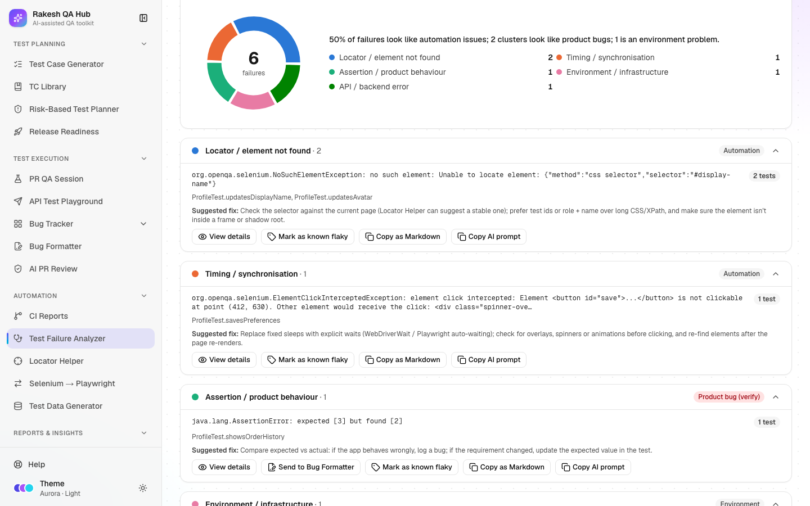

# Test Failure Analyzer

**Section:** Automation · **Page:** `/failure-analyzer`

## Purpose

The Test Failure Analyzer reads failed automated tests and groups them by likely root cause. You paste logs, upload TestNG, JUnit or Playwright reports, or pull a failed run from CI Reports. You get clusters of failures that share the same cause, each labelled with a category and a suggested fix. The analyzer also separates **script issues** (problems in the test code or setup) from **likely product bugs** (the app itself behaving wrongly).

## The problem it solves

**Before:** a nightly run fails 60 tests and someone reads 60 stack traces one by one. Most turn out to be the same broken locator or a slow environment. Real product bugs hide among them, and nobody remembers which failures are known flaky tests.

**After:** 60 failures become, for example, five clusters. A summary line says how many look like automation problems and how many look like product bugs. Known flaky tests are badged and can be hidden, product-bug clusters go to the [Bug Formatter](bug-formatter.md) in one click, and saved analyses show trends over time.

## Who should use it and when

- **Automation engineers** — every morning after the nightly run, or whenever a CI run fails.
- **QA engineers** — to decide quickly whether a failure needs a bug report or a test fix.
- **QA leads** — to watch trends: are locator failures going down, and is the environment stable?

## Key features

- Three inputs:
  - **Paste logs** — stack traces, TestNG/Maven console output or Playwright list output. **Load sample** shows an example.
  - **Upload report** — `testng-results.xml`, JUnit/Surefire `TEST-*.xml`, Playwright `results.json`, or `.txt` / `.log` files.
  - **From CI** — pick a **CI suite** and a **Failed run** from CI Reports.
- **Analyze** groups failures into clusters with the same signature (normalised message plus the top application stack frame).
- Seven categories:
  - Locator / element not found
  - Timing / synchronisation
  - Assertion / product behaviour
  - Test data / setup
  - Environment / infrastructure
  - API / backend error
  - Unknown
- Per cluster:
  - an owner badge (Automation, Product bug (verify) or Environment) and a **Suggested fix**
  - **View details** — the full message and stack trace
  - **Send to Bug Formatter** — for product-bug categories
  - **Mark as known flaky**
  - **Copy as Markdown**
  - **Explain with AI** — when AI is on; otherwise **Copy AI prompt**
- **Hide known issues**, **Save analysis**, **Saved analyses**, a **Known issues** list and a **Failures per category over time** chart.

## How to use it

1. Open **Test Failure Analyzer** from the **Automation** section of the sidebar.
2. Choose an input:
   - **Paste logs** — paste stack traces or console output, or click **Load sample** to try it.
   - **Upload report** — drop report files on the box or click **Choose files**.
   - **From CI** — pick a **CI suite** and a **Failed run**.
3. Click **Analyze**.
4. Read the summary line and the category chart, then go through the clusters, largest first.
5. For each cluster:
   - Read the owner badge, the affected tests and the **Suggested fix**.
   - Open **View details** for the stack trace.
   - If it's a real product problem, click **Send to Bug Formatter**.
   - If it's a known flaky test, click **Mark as known flaky**, give it a **Label** and optional **Notes**, then **Save**.
6. Optional: click **Explain with AI** (or **Copy AI prompt**) for a second opinion on a tricky cluster.
7. Click **Save analysis** and give it a **Name** (defaults to the date and time) to track trends.
8. Check **Saved analyses** and the trend chart after a few runs.

## Worked example

You paste the console output of a failed Checkout suite with 12 failures and click **Analyze**:

> **58% of failures look like automation issues; 1 cluster looks like a product bug; 2 are environment problems.**

| Cluster | Category | Count | Suggested fix |
|---|---|---|---|
| `NoSuchElementException: #checkout-submit` | Locator / element not found | 5 | Update the locator; prefer a test id or role + name |
| `TimeoutException waiting for .spinner` | Timing / synchronisation | 2 | Wait for a specific condition instead of a fixed sleep |
| `expected total 90.00 but was 100.00` | Assertion / product behaviour | 3 | Check whether the discount rule changed; log a bug if not |
| `WebDriverException: unknown error: net::ERR_CONNECTION_REFUSED` | Environment / infrastructure | 2 | Check the test environment is up and reachable, then re-run |

You send the assertion cluster to the Bug Formatter, fix the locator using the [Locator Helper](locator-helper.md), and save the analysis as "Checkout nightly".

## Understanding the output

- **Summary line** — the percentage of failures in automation-side categories (locator, timing, test data), how many clusters look like product bugs (assertion, API), and how many failures are environment problems.
- **Totals** — failures, plus passed and skipped tests when the report includes them.
- **Category chart** — failures per category. Unknown is shown in grey.
- **Cluster** — one card per root cause, showing the representative message, the number of tests, the affected test names, an owner badge (**Automation**, **Product bug (verify)** or **Environment**) and the suggested fix.
- **Known badge** — the cluster matches a known flaky issue. **Hide known issues (n)** hides them.
- **AI explanation** — a **Likely root cause**, whether the AI agrees with the category, and a fix. It's cached so the same cluster isn't re-asked.
- **Failures per category over time** — one point per saved analysis, so you need at least two.

## Tips and best practices

- Upload the XML/JSON report when you can; it's more accurate than console text.
- Fix the biggest automation cluster first. One locator fix often clears many failures.
- Treat "Assertion / product behaviour" and "API / backend error" as product bugs until proven otherwise.
- Mark something as known flaky only when it's really known, and write a note saying why. Otherwise real bugs get hidden.
- Save an analysis after each nightly run for a week to see whether stability is improving.

## Limitations and things to know

- Parsing happens in your browser. Inputs are limited to 5 MB and 2,000 failures per analysis.
- **From CI** needs a GitHub token (`GITHUB_TOKEN`) set by the hub owner and at least one suite in [CI Reports](ci.md). You can always paste or upload instead.
- Categories come from rules (patterns in messages and stack traces). They are good guesses, not certainties.
- Saved analyses store the summary and clusters with a short stack sample, not your raw logs.
- AI explanations need AI to be on (limited to 20 per hour). Without it, use **Copy AI prompt**.
- Deleting saved analyses or known issues needs the admin passcode.

## Works well with

- [CI Reports](ci.md) — **From CI** reads a failed run's job logs directly.
- [Bug Formatter](bug-formatter.md) — **Send to Bug Formatter** pre-fills a bug from a product-bug cluster.
- [Locator Helper](locator-helper.md) — fix "element not found" clusters with sturdier locators.
- [Bug Tracker](bug-tracker.md) — log confirmed product bugs from the formatter.

## FAQ

**Which report formats are supported?**
TestNG `testng-results.xml`, JUnit/Surefire `TEST-*.xml`, Playwright `results.json`, and plain-text logs (`.txt` / `.log`), including TestNG/Surefire console output and Playwright list output.

**Why is a cluster "Unknown"?**
No rule matched its message or stack trace. Open **View details**, or ask the AI for a second opinion.

**Is my log data stored?**
Only when you click **Save analysis**, and then only the clusters and a short stack sample, not the full logs.

**What does "Mark as known flaky" do?**
Future analyses badge failures with the same signature as known, and you can hide them with **Hide known issues**.
