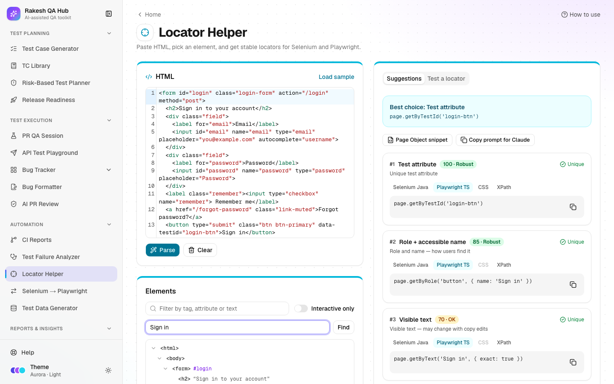

# Locator Helper

**Section:** Automation · **Page:** `/locator-helper`

## Purpose

The Locator Helper finds stable **locators** for your automated tests. A locator is the instruction a test uses to find an element on the page, such as "the button named Sign in". You paste a page's HTML, pick an element, and get a ranked list of locators for Selenium (Java) and Playwright (TypeScript), each scored for how likely it is to survive future page changes.

## The problem it solves

**Before:** automation engineers copy a long XPath from the browser's developer tools, such as `/html/body/div[3]/div/form/button[2]`. It breaks the next time a developer adds a wrapper `div`, and the nightly run fails for reasons that have nothing to do with product quality.

**After:** the helper suggests locators based on test IDs, roles and accessible names, labels and unique attributes, and explains why each is strong or fragile. You can test any locator against the pasted HTML and generate a Page Object snippet in one click.

## Who should use it and when

- **Automation engineers** — when writing new tests or fixing "element not found" failures.
- **Manual testers learning automation** — to see which locator styles are robust and why.
- **Developers** — to check whether a component has good test hooks (a `data-testid` or an accessible name) before release.

## Key features

- An **HTML** editor with **Load sample**, **Parse** and **Clear**. Paste a single element, a form or a whole page.
- An **Elements** tree with a filter (by tag, attribute or text), **Interactive only** and **Find by text**.
- **Suggestions** for the selected element, ranked by score. Each shows code in **Selenium Java**, **Playwright TS**, **CSS** and **XPath**.
- Strategies, strongest first:
  - Test attribute
  - ID
  - Role + accessible name
  - Label
  - Placeholder
  - Name attribute
  - Visible text
  - Short CSS
  - Relative XPath
  - Absolute XPath
- A **Robust**, **OK** or **Fragile** badge with a 0–100 score and a reason.
- **Test a locator** — type a CSS selector or XPath and see how many elements match, highlighted in the tree.
- **Page Object snippet** for Selenium Java and Playwright TypeScript.
- AI alternatives when AI is on, or **Copy prompt for Claude** otherwise.

## How to use it



1. Open **Locator Helper** from the **Automation** section of the sidebar.
2. In your app, right-click the element (or its form) → **Inspect** → right-click the HTML node → **Copy** → **Copy outerHTML**.
3. Paste it into the **HTML** box and click **Parse**. (Or click **Load sample** to try it first.)
4. In **Elements**, click the element you want. Tick **Interactive only** to hide layout tags, or use **Find by text** (e.g. "Sign in").
5. Read **Suggestions**. The best locator is at the top. Switch the format tabs to see Selenium Java, Playwright TS, CSS or XPath code, and click **Copy**.
6. To check a selector you already use, type it into **Test a locator** (CSS or XPath) and see how many elements it matches.
7. Open **Page Object snippet** to get a ready field and method for your page class.
8. Optional: ask the AI for alternatives, or click **Copy prompt for Claude** and paste the prompt into Claude.

## Worked example

You paste this login form:

```html
<form id="login">
  <label for="email">Email</label>
  <input id="email" name="email" type="email">
  <button type="submit" data-testid="login-submit">Sign in</button>
</form>
```

You select the button. Suggestions:

| Strategy | Playwright TS | Selenium Java | Score |
|---|---|---|---|
| Test attribute | `page.getByTestId('login-submit')` | `By.cssSelector("[data-testid='login-submit']")` | 100 · Robust |
| Role + accessible name | `page.getByRole('button', { name: 'Sign in' })` | `By.xpath("//button[normalize-space()='Sign in']")` | 85 · Robust |
| Visible text | `page.getByText('Sign in', { exact: true })` | `By.xpath("//button[normalize-space()='Sign in']")` | 70 · OK |
| Short CSS | `page.locator('button[type="submit"]')` | `By.cssSelector("button[type='submit']")` | 65 · OK |
| Relative XPath | `page.locator('xpath=//form[@id="login"]//button[@type="submit"]')` | `By.xpath("//form[@id='login']//button[@type='submit']")` | 50 · OK |
| Absolute XPath | — | `By.xpath("/html/body/form/button")` | 25 · Fragile |

Testing your old selector `//form/button[2]` in **Test a locator** shows **0 matches**, which explains why your test was failing.

## Understanding the output

- **Score (0–100)** — starts from the strategy's base value. It drops by 40 if the locator isn't unique, 30 if it looks auto-generated, 15 if it relies on position and 10 for long text, and gains 5 for a short, unique selector. Base values:
  - Test attribute — 95
  - ID — 90
  - Role + name, and Label — 85
  - Placeholder and Name attribute — 75
  - Visible text — 70
  - Short CSS — 60
  - Relative XPath — 50
  - Absolute XPath — 20
- **Badges** — **Robust** (80 or more), **OK** (50–79), **Fragile** (below 50).
- **Reason** — why the score is what it is, e.g. "Visible text — may change with copy edits".
- **"AI suggestion"** — suggestions from AI are re-checked against your HTML and scored the same way. They get 0 if they don't select the element.
- **Tester result** — the number of matching elements. Exactly 1 is what you want.

## Tips and best practices

- Prefer test attributes (`data-testid`) and role + name locators. Ask developers to add test IDs to key controls.
- Avoid absolute XPath and index-based selectors (`div[3]`). They break on small layout changes.
- Text-based locators break when copy changes or the app is translated. Use them with care.
- Copy the HTML of the whole form or section, not just the element, so the helper can see labels and parents.
- Run your existing selectors through **Test a locator** when a test starts failing with "element not found".

## Limitations and things to know

- Pasted HTML is analysed in your browser and is never rendered or sent to the server (except the selected element's context, when you use AI).
- The helper sees static HTML only. Elements created later by JavaScript, iframes and shadow DOM content aren't included unless they're in what you paste.
- Accessible names are worked out in a simplified way (aria-label, label, text, alt, title), so the real browser may differ slightly.
- The element tree shows up to 1,500 rows.
- AI alternatives need AI to be on (limited to 20 per hour).

## Works well with

- [Test Failure Analyzer](failure-analyzer.md) — fix "Locator / element not found" clusters here.
- [Selenium → Playwright Converter](selenium-to-playwright.md) — check converted locators and upgrade them to `getByRole` / `getByTestId`.
- [PR QA Session](pr-qa-session.md) — its generated specs prefer the same locator styles (roles, labels, test IDs).

## FAQ

**Why is my ID-based locator not at the top?**
The ID may not be unique in the pasted HTML, or it looks auto-generated (for example `ember123`). Both lower the score.

**Do I need AI?**
No. All the ranking, testing and Page Object snippets work without AI.

**Can I paste a whole page?**
Yes. Large pages work, but the tree shows up to 1,500 rows. Use the filter or **Find by text** to get to your element.

**Is my HTML stored?**
Only as a draft in your browser so you don't lose it on refresh. It isn't saved on the server.
