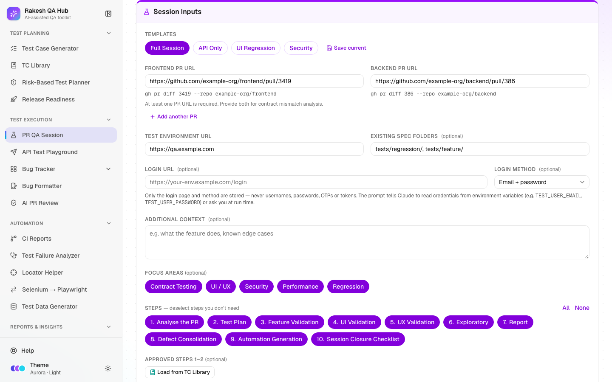

# PR QA Session

**Section:** Test Execution · **Page:** `/pr-qa-session`

## Purpose

PR QA Session builds a complete, step-by-step testing prompt for **Claude Code**, Anthropic's command-line AI assistant, from one or more pull request (PR) URLs. You paste the prompt into Claude Code in your terminal. Claude then reads the code changes, writes a test plan for your approval, tests the app in a real browser, reports bugs and writes Playwright tests, pausing at two approval points.

## The problem it solves

**Before:** testing a PR means reading the PR description (which may not match the code), guessing what else the change could break, and testing by hand. Results end up scattered, and automation is written later, if at all. Asking an AI to "test this PR" gives shallow, inconsistent results.

**After:** one prompt gives Claude a strict 10-step method:

- analyse every changed file, check the frontend/backend contract and trace the impact radius;
- plan, then wait for your approval;
- test in a live browser with screenshots and console checks;
- report, then wait for your team's findings;
- consolidate the defects, generate four kinds of Playwright specs, and close with a checklist and a Go / No-Go recommendation.

## Who should use it and when

- **QA engineers** — when a PR is ready for QA, before it merges.
- **QA leads** — to standardise how every PR is tested, using templates and focus areas.
- **Developers** — to get a QA-style review of their own change before asking for review.

## Key features

- **Frontend PR URL**, **Backend PR URL** and **Add another PR**. Each valid URL shows its `gh pr diff <number> --repo <owner/repo>` command underneath.
- **Test Environment URL**, **Existing Spec Folders** (default `tests/regression/, tests/feature/`), **Login URL** and **Login Method** (SSO, Email + password, Magic link, Other).
- Templates — **Full Session**, **API Only**, **UI Regression** and **Security** — plus **Save current** for your own.
- **Focus areas** — Contract Testing, UI / UX, Security, Performance and Regression. Each adds specific instructions to the prompt.
- **Additional context** — a risk level such as "Risk: Critical" makes the plan deeper.
- **Steps** chips (1–10) with **All** / **None**, and **Resume From Step**.
- **Style Reference** — paste a sample spec or Page Object so generated tests match your style.
- **Load from TC Library** — start from an approved plan at Step 3.
- Output: an editable prompt with **Copy**, **Reset** and **Download .md**.

## How to use it

1. Open **PR QA Session** from the **Test Execution** section of the sidebar. Read **Before you start**: you need the GitHub CLI (`gh`) signed in and Playwright MCP (Claude's browser tool) connected in Claude Code.
2. Paste a **Frontend PR URL**, a **Backend PR URL**, or both. Check that the `gh pr diff` command under each one looks right.
3. Fill **Test Environment URL** and, if needed, **Login URL** and **Login Method**. Never enter usernames or passwords. The prompt tells Claude to read them from environment variables or ask you.
4. Pick a template, or choose **Focus areas** and **Steps** yourself.
5. Optional: add **Additional context** (for example "Risk: High — payment flow"), change **Existing Spec Folders**, or paste a **Style Reference**.
6. Optional: click **Load from TC Library** to reuse an approved plan, or pick a later step in **Resume From Step**.
7. Click **Build Prompt**. Read and edit the prompt if you like, then click **Copy** (or **Download .md**).
8. Paste it into Claude Code in your project folder. Reply `Approved` or `Approved with changes: …` at the first STOP. At the second STOP, share your team's findings.
9. Save the approved Step 1 + Step 2 output in the [TC Library](tc-library.md), and send bugs to the [Bug Formatter](bug-formatter.md).

## Worked example

Inputs:

- **Frontend PR URL:** `https://github.com/example-org/frontend/pull/3419`
- **Backend PR URL:** `https://github.com/example-org/backend/pull/386`
- **Test Environment URL:** `https://qa.example.com`
- **Login Method:** Email + password
- **Template:** Full Session, with all focus areas

The prompt (about 265 lines) starts with **Prerequisites**, **Data Safety** and an **Inputs** table containing `gh pr diff 3419 --repo example-org/frontend` and `gh pr diff 386 --repo example-org/backend`. Then come Steps 1–10:

- **Step 1** analyses the frontend diff, the backend diff and any contract mismatches, then the impact radius, an AI code-quality review and a security review.
- **Step 2** is the test plan, which ends with *"STOP — Do not begin any browser interaction until the plan is approved."*
- **Steps 3–6** cover feature, UI, UX and exploratory testing.
- **Step 7** is the report, which ends with *"STOP — wait for the team's findings before Step 8."*
- **Steps 8–10** cover defect consolidation, spec Categories A–D, and the closure checklist with a Go / No-Go recommendation.

## Understanding the output

- **Inputs table** — `<not provided>` marks anything you left empty. "Login method: <not provided> — ask before Step 3" means Claude will ask you how to log in.
- **Scope** — explains what is skipped and why. For example, a frontend-only PR skips contract analysis and Category D.
- **Step 1 tables:**
  - **Changed File | Imports From | Consumed By | Existing Specs | Risk Level** — the impact radius, meaning everything that uses the changed code.
  - **Flag Type | Location | Detail | Severity** — AI code-quality flags.
- **Test case IDs** — `TC-01` for UI tests and `TC-API-01` for API tests. Priorities are P1–P3, and each case has a Spec Category (A–D, or None).
- **Spec categories (Step 9):**
  - **A** — feature specs (`@feature @smoke`).
  - **B** — defect specs (`@regression @critical`).
  - **C** — regression guards (`@regression`).
  - **D** — API contract specs (`@regression @api`).
- **Templates change the content**, not just which steps run:
  - **API Only** — Steps 1, 2, 3, 7, 8, 9 and 10, with API test cases and Category D only.
  - **UI Regression** — Steps 1, 2, 4, 5, 6, 7, 9 and 10, with Categories A and C.
  - **Security** — all steps, with extra security checks.
- Step numbers never change when you deselect steps, so references between steps stay valid.

## Tips and best practices

- Give both PRs when a change spans frontend and backend; that is when the contract-mismatch check earns its keep.
- Put a risk level in **Additional context** for important changes. "Risk: Critical" makes negative and edge cases mandatory for every P1 area.
- Paste a real spec from your project into **Style Reference** so generated tests drop straight into your suite.
- Review Claude's plan properly at the first STOP. It is cheaper to fix the plan than the testing.
- Use **Resume From Step** if a session is interrupted. Claude will ask you to paste the earlier outputs.

## Limitations and things to know

- The prompt runs in **Claude Code** (the CLI), not in the Claude chat website. It needs `gh` authenticated and Playwright MCP connected.
- This page doesn't call GitHub or AI itself. It only builds text, so it works without any keys.
- Credentials are never stored. Login URLs are cleaned of anything that looks like a password or token, and a note tells you when something was removed.
- Saved templates are visible to everyone and keep only the selections, the login URL and method, and the spec folders.
- Screenshots Claude takes may contain client data. The prompt tells Claude to keep them in the session and use placeholders.

## Works well with

- [Risk-Based Test Planner](risk-planner.md) — **Send to PR QA Session** pre-selects focus areas from the riskiest factors.
- [TC Library](tc-library.md) — save approved Steps 1–2, then **Load from TC Library** to resume at Step 3.
- [Bug Formatter](bug-formatter.md) — paste Claude's Step 7 findings to get Jira or Slack-ready bugs.
- [AI PR Review](ai-pr-review.md) — log Claude's code-quality flags there to track them across PRs.
- [Release Readiness](release-readiness.md) — use the Step 10 Go / No-Go recommendation as evidence.

## FAQ

**Can I use only one PR?**
Yes. With only a frontend PR, contract analysis and API contract specs are skipped. With only a backend PR, UI checks focus on screens that use the changed endpoints. The prompt explains this in its **Scope** section.

**Where do I put my test account password?**
Nowhere in the hub. Set environment variables such as `TEST_USER_EMAIL` and `TEST_USER_PASSWORD` in your terminal, or type them when Claude asks.

**What does "STOP" mean in the prompt?**
Claude pauses there and waits for you. After Step 2 it waits for your approval of the plan; after Step 7 it waits for your team's findings.

**Can I edit the prompt before copying?**
Yes. Edit it in the output box. **Reset** brings back the generated version.

**Why is a step missing from my prompt?**
It was deselected in **Steps**, or the template doesn't use it. Skipped steps are listed under **Scope**.
