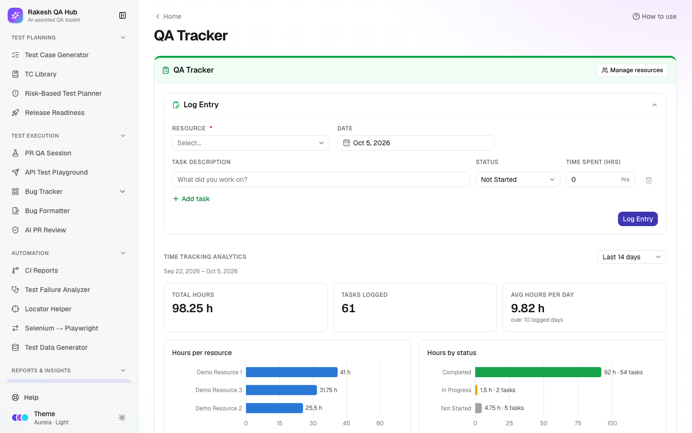

# QA Tracker

**Section:** Reports & Insights · **Page:** `/qa-tracker`

## Purpose

The QA Tracker is a simple daily log of QA work. Each team member (called a **resource** here) records what they worked on, its status and the hours spent. The page turns those logs into charts for the last 7, 14 or 30 days and a searchable history grouped by date.

## The problem it solves

**Before:** at the end of a sprint, nobody can say where QA time went. Time spent on regression, exploratory testing and meetings is invisible, estimates for the next sprint are guesses, and stand-up updates are lost the moment they're spoken.

**After:** a one-minute log per day per person builds a clear record: total hours, tasks logged, average hours per day, hours per person and by status. Leads can spot overload, and managers see how effort is spread.

## Who should use it and when

- **QA engineers** — at the end of each day (or task), to log what they did.
- **QA leads** — weekly, to review workload and status across the team, and when planning capacity.
- **Managers** — at sprint or month end, for a summary of QA effort.

## Key features

- **Manage resources** — add team members (**Name**, optional **Email**), rename them, mark them inactive, or delete them.
- **Log Entry** form:
  - **Resource** and **Date** (no future dates).
  - One or more task rows, each with **Task description**, **Status** and **Time spent (hrs)**.
  - **Add task** adds another row.
- **Status** — Not Started, In Progress or Completed.
- **Time Tracking Analytics** for the last 7, 14 or 30 days:
  - **Total hours**, **Tasks logged** and **Avg hours per day**.
  - Charts: **Hours per resource**, **Hours by status** and **Daily hours**.
  - **Show the data as a table** — the same numbers as a table.
- **Task history** per person: grouped by date (DD/MM/YYYY), searchable, with inline status and hours edits and **Load older dates**.

## How to use it

1. Open **QA Tracker** from the **Reports & Insights** section of the sidebar.
2. First time only: click **Manage resources**, type a **Name** (and optionally an **Email**), and click **Add resource** for each team member.
3. In **Log Entry**, pick the **Resource** and **Date** (today by default).
4. Type the **Task description**, choose a **Status**, and enter **Time spent (hrs)**, e.g. `1.5`.
5. Click **Add task** for more rows if you worked on several things that day.
6. Click **Log Entry**. The history switches to that person's tab and shows the new tasks.
7. In **Time Tracking Analytics**, choose the period (7, 14 or 30 days) and read the totals and charts.
8. In the history, search tasks, change a status or hours inline, or click **Load older dates** to go further back.

## Worked example

"Demo Resource 1" logs Monday's work:

| Task description | Status | Time spent (hrs) |
|---|---|---|
| Checkout regression — Chrome and Safari | Completed | 3 |
| Exploratory testing of the coupon field | In Progress | 2.5 |
| Bug triage meeting | Completed | 1 |

After **Log Entry**, the history for Demo Resource 1 shows the date with three tasks and 6.5 hours. Over 14 days, analytics show, for example, **Total hours 96**, **Tasks logged 41**, **Avg hours per day 6.9**. **Hours per resource** shows that Demo Resource 2 logged far fewer hours, which is worth checking with them. **Hours by status** shows how much work is still in progress.

## Understanding the output

- **Total hours** — all hours logged in the period, for everyone.
- **Tasks logged** — the number of task rows in the period.
- **Avg hours per day** — total hours ÷ the number of days that have logs (empty days aren't counted).
- **Hours per resource** — a bar per person.
- **Hours by status** — bars for Not Started (grey), In Progress (amber) and Completed (green), each labelled with text.
- **Daily hours** — a line showing hours per day across the period.
- **Status pills** in the history use the same colours.
- **Show the data as a table** — the chart numbers as an accessible table.

## Tips and best practices

- Log daily, not at the end of the week; memories fade fast.
- Keep task descriptions specific ("Checkout regression — Safari" rather than "testing") so the history is useful later.
- Use statuses honestly. A lot of "In Progress" hours can signal blocked work.
- Mark people who leave the team **inactive** instead of deleting them, so their history stays.
- Review the 30-day view before sprint planning to set realistic QA capacity.

## Limitations and things to know

- Hours per task must be more than 0 and at most 24, in steps of 0.25 (15 minutes).
- Dates can't be in the future.
- Inactive people are hidden from the form and tabs, but their history is kept.
- Deleting a task or a resource needs the admin passcode, and deleting a resource also deletes their logs.
- There are no logins; anyone can log for any resource. Agree as a team that people log their own work.
- The log is visible to everyone using the hub. Don't put client names or personal data in task descriptions.

## Works well with

- [Bug Tracker](bug-tracker.md) — compare logged testing hours with the issues found per feature.
- [Risk-Based Test Planner](risk-planner.md) — compare planned hours per area with the hours actually logged.
- [Automation ROI](automation-roi.md) — QA Tracker shows manual effort; ROI shows the time automation saves.

## FAQ

**Why can't I log work?**
You need at least one active resource. Click **Add a resource** (or **Manage resources**) first.

**Can I log several tasks at once?**
Yes. Click **Add task** for each extra row before clicking **Log Entry**.

**Can I fix a mistake?**
Yes. Change the status or hours directly in the history. To remove a task, use delete (passcode needed).

**Why is "Avg hours per day" higher than I expected?**
It only counts days that have logs. Weekends and days off don't pull the average down.
