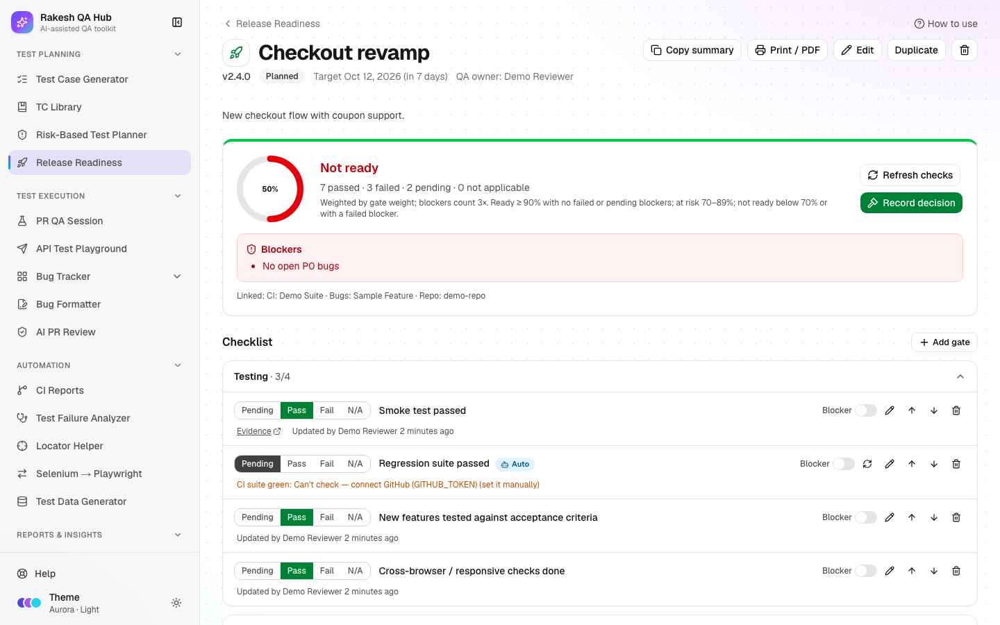

# Release Readiness

**Section:** Test Planning · **Page:** `/release-readiness`

## Purpose

Release Readiness gives each release a checklist of **quality gates** and a readiness score. A quality gate is a condition the release must meet before it ships, such as "No open P0 bugs" or "Rollback plan documented". Some gates check themselves against CI runs, the Bug Tracker and AI PR Review. When the team decides, you record a **Go / No-Go** decision, which freezes a snapshot of the checklist as it stood.

## The problem it solves

**Before:** release status lives in a spreadsheet, a chat thread and people's heads. "Are we ready?" takes a meeting, blockers are found late, and nobody can later show what the team knew when it said "Go".

**After:** one page per release shows the score, the verdict, the failing blockers and who has signed off. Automatic gates read live data, the decision is recorded with a comment and a frozen snapshot, and every change is in the activity log.

## Who should use it and when

- **QA leads and release managers** — from the start of testing until release day, to track gates and run the Go / No-Go call.
- **QA engineers** — to mark manual gates Pass or Fail and attach evidence links.
- **Dev leads and product owners** — to sign off and to see the known issues being shipped.

## Key features

- **New Release** with **Name**, **Version**, **Target date**, **QA owner**, **Description / scope** and a **Template**.
- **Linked data (optional — powers the auto gates)** — link CI suites, Bug Tracker feature pages and AI PR Review repos.
- Gate types:
  - **Manual**
  - **CI suite green**
  - **No open P0 bugs**
  - **No open P1 bugs**
  - **Valid-bug rate**
  - **No unresolved P0 review flags**
- A **Readiness score** (0–100%) and a verdict: **Ready to go**, **At risk** or **Not ready**.
- **Blocker** gates, weights, owners, evidence links, and overrides with a required note.
- **Sign-offs** — QA, Dev lead and Product by default. **Add role** adds more.
- **Record decision** (Go, No-Go, Go with known issues), then **Mark as released**.
- **Copy summary** (Markdown or Slack), **Print / PDF**, **Duplicate**, an **Activity** log and editable checklist templates.

## How to use it

1. Open **Release Readiness** from the **Test Planning** section of the sidebar.
2. Click **New Release**. Fill **Name** (e.g. "Checkout revamp"), **Version** (e.g. "v2.4.0"), **Target date** and **QA owner**.
3. Choose a **Template**. The built-in "Standard release" has four sections: Testing, Defects, Code & review, and Deployment.
4. Under **Linked data**, pick **CI suites**, **Bug Tracker feature pages** and **AI PR Review repos**. These power the automatic gates.
5. Click **Create**, then open the release.
6. In **Checklist**, set each manual gate to **Pass**, **Fail** or **N/A**, and add an **Evidence link** (a CI run, test report or ticket). Automatic gates show an **Auto** badge and fill themselves; click **Refresh checks** to re-run them.
7. If an automatic result doesn't apply, change that gate's status yourself. You'll be asked for a **Note** explaining why (this is an override). **Clear override** goes back to the automatic result.
8. Use **Add gate** for release-specific checks. Changes affect this release only, not the template.
9. In **Sign-offs**, each person clicks **Sign** and chooses Approved or Rejected, with an optional comment. Their **Your name** value is shown.
10. When the team is ready, click **Record decision**. Pick **Go**, **No-Go** or **Go with known issues**, and write a **Comment**. For "Go with known issues", list the issues one per line.
11. After a Go, click **Mark as released** and enter the actual **Release date**.
12. Share the status with **Copy summary** → **Markdown** or **Slack**, or **Print / PDF**.

## Worked example

Release "Checkout revamp v2.4.0" uses the Standard release template. It is linked to the "Checkout regression" CI suite, the Checkout feature page and the `example-org/frontend` repo.

- **Regression suite passed** (CI suite green) → Pass: latest run green for 1 suite.
- **No open P0 bugs** (Blocker) → Pass: 0 open P0 issues.
- **No open P1 bugs** → Fail: 1 open P1 issue.
- **No unresolved P0 review flags** → Pass: 0 P0 flags in the last 14 days.
- Manual gates → 7 of 8 Pass. "Rollback plan documented" is still Pending.

The score is 86%, so the verdict is **At risk**. The team fixes the P1 bug, the auto gate flips to Pass on **Refresh checks**, and the rollback plan is linked as evidence. The score reaches 100% and the verdict is **Ready to go**. QA, Dev lead and Product approve. You record **Go** with the comment "All gates green". A snapshot is frozen, and **Copy summary → Slack** gives a ready-to-post status message.

## Understanding the output

- **Readiness score** — the weighted share of passed gates among applicable gates. N/A gates are left out, and a blocker counts three times its weight.
- **Verdict:**
  - **Not ready** (red) — any blocker has failed, or the score is below 70%.
  - **At risk** (amber) — the score is 70–89%, or a blocker is still pending.
  - **Ready to go** (green) — the score is 90% or more and no blocker is failed or pending.
- **Gate status** — Pending, Pass, Fail or N/A. An override wins over an automatic result, which wins over the manual value.
- **Automatic gate "Can't check — …"** — the gate is missing linked data, the GitHub connection, or issues. It stays manual until that's fixed.
- **Automatic gate rules:**
  - **CI suite green** — the latest completed run of every linked suite succeeded.
  - **No open P0 / P1 bugs** — counts valid issues that are Open or In Progress.
  - **Valid-bug rate** — at least 80% of issues are valid (the threshold is configurable).
  - **No unresolved P0 review flags** — no P0 flags in the last 14 days.
- **Blockers** panel — failed blocker gates, which keep the release Not ready.
- **Status** (on the list page) — Planned, In testing, Go, No-Go, Go with known issues or Released. "(overdue)" means the target date has passed.

## Tips and best practices

- Link data at creation time; automatic gates save the most effort.
- Mark only true must-haves as **Blocker**. Too many blockers make the verdict meaningless.
- Always attach an **Evidence link** to manual Pass results. It makes the decision auditable.
- Use **Manage templates** to shape the checklist your team really uses, then pick it for every release.
- Use **Duplicate** for the next release in a series; it keeps the gates and links.

## Limitations and things to know

- **CI suite green** needs the hub owner to set a GitHub token (`GITHUB_TOKEN`). Without it the gate shows "Can't check".
- Changing a recorded decision needs the admin passcode, and so does deleting a release or a gate.
- **Mark as released** is only available after Go or Go with known issues.
- Editing a template doesn't change releases that already exist.
- **Print / PDF** uses your browser's print dialog. Choose "Save as PDF" there.

## Works well with

- [CI Reports](ci.md) — suites you add there can be linked to the CI suite green gate.
- [Bug Tracker](bug-tracker.md) — feature pages feed the P0, P1 and valid-rate gates.
- [AI PR Review](ai-pr-review.md) — logged P0 flags feed the review-flags gate.
- [Risk-Based Test Planner](risk-planner.md) — link plans to the release, and list deferred areas as known issues.
- [PR QA Session](pr-qa-session.md) — its Step 10 Go / No-Go recommendation is useful evidence for your decision.

## FAQ

**Why does a gate say "Can't check"?**
The release isn't linked to the data that gate needs, GitHub isn't connected, or there's no data yet. Link it in **Edit**, or set the gate manually.

**Can I change a decision after recording it?**
Yes, but it needs the admin passcode, and the change is logged in **Activity**.

**What is the frozen snapshot?**
A copy of every gate's status at the moment of the decision. Later changes don't alter what the team decided on.

**Do sign-offs affect the score?**
No. The score only uses gates. Sign-offs show who approved and are included in the summary.
