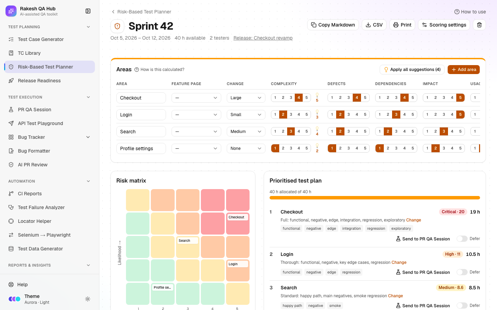

# Risk-Based Test Planner

**Section:** Test Planning · **Page:** `/risk-planner`

## Purpose

The Risk-Based Test Planner helps you decide where to spend limited testing time. You list the areas in scope for a sprint or release and score each one on a few simple factors. The planner works out a risk level and a test depth for each area, and splits your available hours between them, so the riskiest areas get the most attention.

**Risk-based testing** means testing the parts most likely to break, and most costly if they do, first and deepest.

## The problem it solves

**Before:** test effort is shared out by gut feeling or by whoever shouts loudest. Low-risk areas get as much time as critical ones, the riskiest change is tested on the last afternoon, and nobody writes down what was deliberately left out.

**After:** every area gets a visible score with a written method behind it, a recommended depth and an hour budget that adds up to your capacity. Areas you choose not to test are listed as **accepted risks**, with a reason everyone can see.

## Who should use it and when

- **QA leads** — at sprint or release planning, to agree test priorities and effort with the team.
- **QA engineers** — before testing starts, to know which areas need full negative and edge-case coverage and which need only a smoke check.
- **Managers and product owners** — to understand and sign off what will not be tested this time.

## Key features

- **New Plan** with dates, **Available testing hours**, optional testers, an optional linked **Release** and a **Start from** choice:
  - Blank
  - Duplicate a previous plan
  - Import areas from Bug Tracker feature pages
- An **Areas** table scored from 1 to 5 on **Complexity**, **Defects** (defect history), **Dependencies**, **Impact** (business impact) and **Usage**, plus **Change** (change size: None, Small, Medium, Large, New feature).
- An automatic **Risk** score and level (Critical, High, Medium, Low) and **Hours**, saved as you type ("Saving…" / "Saved").
- 💡 suggestions from [Bug Tracker](bug-tracker.md) (defect history) and [AI PR Review](ai-pr-review.md) (complexity), never applied without your click. **Apply all suggestions** takes them all.
- A **Risk matrix** (likelihood × impact heat map) and a **Prioritised test plan** with test depth and hours.
- **Defer** an area with a reason so it moves to **Accepted risks (out of scope / deferred)**. **Bring back** restores it.
- **Scoring settings** for one plan: change-size scores, weights, level thresholds and depth text.
- Exports: **Copy Markdown**, **CSV**, **Print**, and **Send to PR QA Session**.

## How to use it

1. Open **Risk-Based Test Planner** from the **Test Planning** section of the sidebar.
2. Click **New Plan**. Fill **Name** (e.g. "Sprint 42"), **Start date**, **End date** and **Available testing hours**. Optionally pick a **Release** and add **Notes**.
3. Under **Start from**, choose **Blank**, **Duplicate a previous plan**, or **Import areas from Bug Tracker feature pages**. Then click **Create**.
4. On the plan page, click **Add area** for each feature or area in scope and type its name. You can link a **Feature page** to get defect suggestions.
5. Score each area: pick **Change**, then set **Complexity**, **Defects**, **Dependencies**, **Impact** and **Usage** from 1 (low) to 5 (high). The **Risk** and **Hours** columns update straight away.
6. If 💡 suggestions appear, read their reasons and accept them one at a time or click **Apply all suggestions**.
7. Optional: type a fixed number in an area's **Hours** field to override the automatic split. Leave it empty to allocate automatically.
8. Read the **Risk matrix** and the **Prioritised test plan**. To leave an area out, click **Defer**, give a **Reason**, and confirm.
9. Share the plan with **Copy Markdown**, **CSV** or **Print**, or click **Send to PR QA Session** to carry the riskiest factors into a session prompt.

## Worked example

Sprint 42 has 40 testing hours and four areas:

| Area | Change | Complexity | Defects | Dependencies | Impact | Usage |
|---|---|---|---|---|---|---|
| Checkout | Large | 4 | 4 | 4 | 5 | 5 |
| Login | Small | 2 | 2 | 3 | 5 | 5 |
| Search | Medium | 3 | 2 | 2 | 3 | 4 |
| Profile settings | None | 1 | 1 | 1 | 2 | 2 |

The planner gives:

- **Checkout** — score about 20 → Critical, Full depth, the largest share of hours.
- **Login** — High, Thorough depth.
- **Search** — Medium, Standard depth.
- **Profile settings** — Low, Light depth (smoke only).

You defer **Profile settings** with the reason "Not changed this sprint; covered by automation". Its hours are shared out among the other three, and it appears under **Accepted risks**.

## Understanding the output

- **Likelihood (1–5)** — a weighted average of Change (30%), Complexity (25%), Defects (30%) and Dependencies (15%).
- **Impact (1–5)** — a weighted average of business impact (70%) and usage (30%).
- **Risk score** — Likelihood × Impact, from 1 to 25.
- **Levels** — **Critical** 16 or more, **High** 10–15.9, **Medium** 5–9.9, **Low** below 5.
- **Test depth by level:**
  - **Critical — Full:** functional, negative, edge, integration, regression and exploratory.
  - **High — Thorough:** functional, negative, key edge cases and regression.
  - **Medium — Standard:** happy path, main negatives and smoke regression.
  - **Low — Light:** smoke / sanity only.
- **Hours** are split in proportion to risk score. Every area gets at least 0.5 h, values are rounded to 0.5 h, and the total matches your capacity. Deferred areas get 0.
- **Risk matrix** — each cell is a likelihood/impact pair. Chips in a cell are areas, and clicking a chip scrolls to its row. Darker, warmer cells are riskier.
- Click **How is this calculated?** to see this explanation on the page.

## Tips and best practices

- Score as a team in a 15-minute session. Agreement on the numbers matters more than precision.
- Link Bug Tracker feature pages so defect history comes from real data, not memory.
- Always give a reason when you **Defer**. It becomes your written record of accepted risk.
- Leave **Hours** on automatic unless you have a fixed commitment, such as a contractual UAT slot.
- Use **Duplicate a previous plan** each sprint and only re-score the areas that changed.

## Limitations and things to know

- Defect suggestions count valid issues from the last 90 days, with P0/P1 issues counted twice. They need linked feature pages.
- Complexity suggestions use AI PR Review flags from the last 30 days on the linked release's repos, so the plan needs a linked release.
- **Scoring settings** apply to one plan only. **Reset to defaults** restores the standard weights.
- Deleting an area or a plan needs the admin passcode.
- The score guides decisions; it doesn't replace judgement. An area with a known customer escalation may deserve more time than its score suggests.

## Works well with

- [Bug Tracker](bug-tracker.md) — import areas from feature pages and get defect-history suggestions.
- [AI PR Review](ai-pr-review.md) — P0/P1 flags raise complexity suggestions.
- [PR QA Session](pr-qa-session.md) — **Send to PR QA Session** turns the top risk factors into focus areas:
  - dependencies → Contract Testing
  - size and complexity → UI / UX
  - top business impact → Security
  - usage → Performance
  - defects → Regression
- [Release Readiness](release-readiness.md) — link the plan to a release, and record deferred areas as known issues there.
- [Test Case Generator](test-case-generator.md) — match each area's depth to Quick, Standard or Exhaustive.

## FAQ

**What's the difference between likelihood and impact?**
Likelihood is how probable a bug is (how much changed, how complex it is). Impact is how bad a bug would be (business value, how many users touch it).

**Can I change the thresholds or weights?**
Yes. Open **Scoring settings** on the plan, change them and click **Save settings**. Only this plan is affected.

**Why didn't my area get exactly the hours I expected?**
Hours are rounded to 0.5 h and every area gets at least 0.5 h, so small areas round up and the largest areas absorb the difference.

**Does deferring delete the area?**
No. It moves to **Accepted risks** with your reason. Click **Bring back** to restore it.
