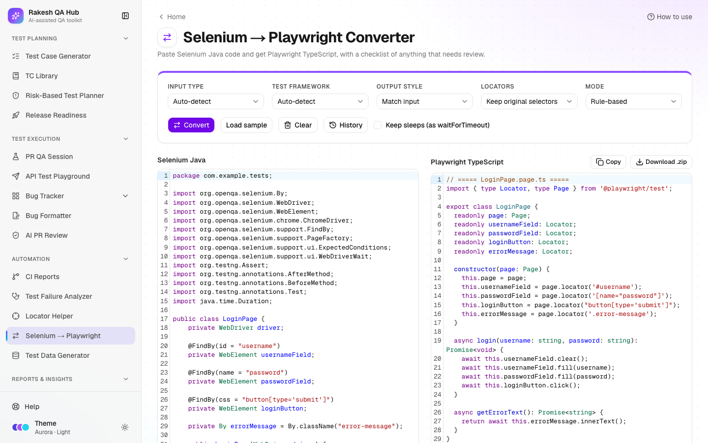

# Selenium → Playwright Converter

**Section:** Automation · **Page:** `/selenium-to-playwright`

## Purpose

The Selenium → Playwright Converter turns Selenium tests and page objects written in Java into Playwright tests in TypeScript. **Selenium** and **Playwright** are both browser-automation tools; Playwright is newer, faster and waits for elements automatically. You paste a Java class, choose a few options and click **Convert**. You get TypeScript code plus review notes that point to every line needing a human look.

## The problem it solves

**Before:** moving a Selenium suite to Playwright means rewriting hundreds of classes by hand. Each locator, wait, assertion and data provider is translated by memory, mistakes slip in, and the work stalls after the first few files.

**After:** the converter handles the repetitive translation: `By` locators become Playwright locators, explicit waits mostly disappear, assertions are rewritten, `await` is added, and TestNG/JUnit structure becomes `test.describe` / `test()`. Anything it can't translate safely is left as a `// TODO(convert)` comment with a note, so you spend time only where judgement is needed.

## Who should use it and when

- **Automation engineers** — during a migration from Selenium to Playwright, one class at a time.
- **QA leads** — to estimate migration effort by converting a sample and counting the review notes.
- **Engineers learning Playwright** — to see how familiar Selenium code looks in Playwright.

## Key features

- A Java input editor with **Load sample** and **Clear**, and a TypeScript output editor.
- **Options:**
  - **Input type** — Auto-detect, Test class or Page Object.
  - **Test framework** — Auto-detect, TestNG, JUnit 4 or JUnit 5.
  - **Output style** — Match input, Playwright Test, Page Object class or Snippet.
  - **Locators** — Keep original selectors, or Prefer getByRole / getByTestId.
  - **Keep sleeps (as waitForTimeout)**.
- **Mode:**
  - **Rule-based** — always available.
  - **AI** — only when AI is turned on.
  - **Build prompt for Claude** — copy the prompt and run it in Claude.
- **Review notes** grouped as **Needs attention**, **Warning** and **Info**. Clicking one highlights its line.
- **Copy**, and **Download .ts** (or **Download .zip** when there are several files).
- **History** of your last 10 conversions (kept in your browser).
- A **Setup checklist** for running the result in a new Playwright project.

## How to use it



1. Open **Selenium → Playwright** from the **Automation** section of the sidebar.
2. Paste a TestNG/JUnit test class or a Page Object into the **Selenium Java** box, or click **Load sample**.
3. Set the **Options**. Auto-detect is fine for most code. Choose **Prefer getByRole / getByTestId** if you want more modern locators.
4. Choose a **Mode**. **Rule-based** works everywhere. Choose **Build prompt for Claude** if you'd rather let Claude convert it.
5. Click **Convert**. The TypeScript appears in the **Playwright TypeScript** box.
6. Work through **Review notes**, starting with **Needs attention**. Click a note to jump to its line and fix what it describes.
7. Click **Copy**, or **Download .ts** / **Download .zip**, and add the files to your Playwright project.
8. Follow the **Setup checklist**: create the project with `npm init playwright@latest`, put specs in `tests/`, set `baseURL` in `playwright.config.ts`, and run `npx playwright test`.

## Worked example

Input (Selenium, TestNG):

```java
public class LoginTest {
  @Test
  public void validLogin() {
    driver.get("https://app.example.com/login");
    driver.findElement(By.id("email")).sendKeys("user@example.com");
    driver.findElement(By.id("password")).sendKeys("Test@1234");
    driver.findElement(By.cssSelector("button[type='submit']")).click();
    wait.until(ExpectedConditions.visibilityOfElementLocated(By.id("dashboard")));
    Thread.sleep(2000);
    Assert.assertEquals(driver.getTitle(), "Dashboard");
  }
}
```

Output (**Rule-based**, default options), file `LoginTest.spec.ts`:

```ts
import { test, expect } from '@playwright/test';

test.describe('login', () => {
  test('valid login', async ({ page }) => {
    await page.goto('https://app.example.com/login');
    await page.locator('#email').fill('user@example.com');
    await page.locator('#password').fill('Test@1234');
    await page.locator("button[type='submit']").click();
    await expect(page.locator('#dashboard')).toBeVisible();
    await expect(page).toHaveTitle('Dashboard');
  });
});
```

The wait became a web-first assertion (`toBeVisible()`) and the sleep was removed. **Review notes** shows one **Warning**: "`Thread.sleep(2000)` removed — Playwright waits automatically; use `expect` for specific conditions." Next steps: move the URL to `baseURL` (`page.goto('/login')`), read the password from an environment variable, and consider **Prefer getByRole / getByTestId**.

## Understanding the output

- **One file or several:**
  - A test class becomes `<Name>.spec.ts`.
  - A page object becomes `<Name>.page.ts`, with locators set up in the constructor.
  - Several classes are shown together and downloaded as a `.zip`.
- **`// TODO(convert): …`** — a line the rules couldn't translate safely. Each one has a **Needs attention** note.
- **Review note levels:**
  - **Needs attention** (red) — must be fixed before running.
  - **Warning** (amber) — works, but is worth improving.
  - **Info** (blue) — explains a change.
- **Data providers** — `@DataProvider`, `@ValueSource` and `@CsvSource` become a `for…of` loop that creates one test per data row.
- **"Nothing flagged"** — no notes, but still give the code a quick read before running it.

## Tips and best practices

- Convert one class at a time and run it before moving on; problems are easier to spot.
- Convert page objects first, then the tests that use them.
- Turn off **Keep sleeps** unless a sleep is truly needed. Playwright waits automatically, so most sleeps only slow tests down.
- Use **Prefer getByRole / getByTestId**, then check the new locators with the [Locator Helper](locator-helper.md).
- Keep secrets in environment variables (`process.env`) in the converted code, just as in the original.

## Limitations and things to know

- Inputs are limited to 50 KB. Convert large files one class at a time.
- The rule-based mode works line by line, without fully understanding Java. Complex logic, custom frameworks, reflection and multi-line wait chains (e.g. `new WebDriverWait(...)` split over two lines) become `TODO(convert)` lines for manual work.
- Plain Java calls that aren't Selenium, such as `System.getenv("X")`, are copied as they are. Replace them with TypeScript (`process.env.X`).
- **AI** mode needs AI to be turned on (limited to 10 per hour, can be cancelled). Otherwise, use **Build prompt for Claude**.
- Selenium `getText()` becomes `innerText()`, which returns the visible text. Check assertions that depended on hidden text.
- History is stored only in your browser (last 10 conversions).

## Works well with

- [Locator Helper](locator-helper.md) — upgrade converted CSS/XPath locators to role or test-ID locators.
- [Test Data Generator](test-data-generator.md) — replace hard-coded test data with generated files; **Use in automation** gives loader code for Playwright.
- [CI Reports](ci.md) — run the new Playwright suite through GitHub Actions and follow it from the hub.
- [Automation ROI](automation-roi.md) — track the time the migrated suite saves.

## FAQ

**Does it support JUnit as well as TestNG?**
Yes: TestNG, JUnit 4 and JUnit 5. Auto-detect usually picks the right one.

**What happens to `WebDriverWait`?**
Single-line waits such as `wait.until(ExpectedConditions.visibilityOfElementLocated(...))` become web-first assertions like `expect(locator).toBeVisible()`. Long or unusual wait chains are left as `TODO(convert)` with a **Needs attention** note.

**Can it convert Python or C# Selenium?**
No. Only Java input is supported.

**Is the converted code ready to run?**
Often nearly, but always review the notes first, fix any `TODO(convert)` lines, and run it locally before committing.
