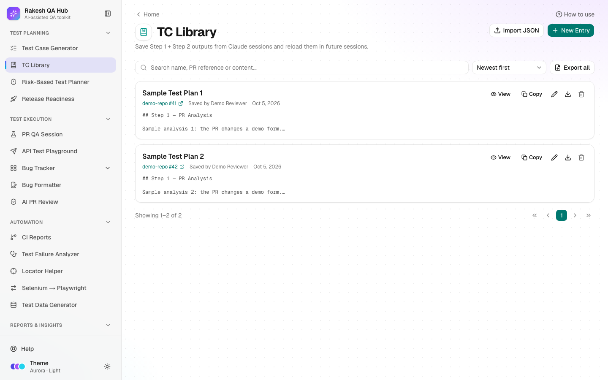

# TC Library

**Section:** Test Planning · **Page:** `/tc-library`

## Purpose

The TC Library ("test case library") is a shared shelf for approved test plans. When Claude finishes Step 1 (the PR analysis) and Step 2 (the test plan) of a [PR QA Session](pr-qa-session.md), or when the [Test Case Generator](test-case-generator.md) produces a set you like, you save the output here. Anyone can search it, copy it, or load it into a new session.

## The problem it solves

**Before:** a good PR analysis and an approved test plan live in one person's chat history or terminal. When the same feature changes again, or a teammate picks up the work, the analysis is redone from scratch.

**After:** approved plans are saved with a name and a PR reference. Anyone can find one by searching, and a new PR QA Session can start from it at Step 3 instead of repeating the analysis.

## Who should use it and when

- **QA engineers** — right after approving Claude's Step 2 test plan, and before starting the next session on the same area.
- **QA leads** — to review what was planned for a PR, or to reuse a strong plan as a starting point for similar work.
- **New team members** — to learn how a feature was tested before.

## Key features

- **New Entry** with **Name**, **PR Reference** (optional) and **Step 1 + Step 2 Output**.
- A warning when an entry with the same name already exists (you can still save).
- PR references become links: a full GitHub pull request URL or `owner/repo #42` opens the PR, and `repo #42` opens a GitHub search.
- Search by name, PR reference or content, and sort by **Newest first**, **Oldest first** or **Name (A–Z)**.
- **View** (rendered Markdown), **Copy**, **Edit**, **Export** (one entry as JSON) and **Delete** on every entry.
- **Import JSON** and **Export all** for backups or for moving entries between hubs.
- **Load from TC Library** on the PR QA Session page reuses an entry.

## How to use it

1. Open **TC Library** from the **Test Planning** section of the sidebar.
2. Click **New Entry**. A card opens.
3. Fill **Name**, e.g. "Checkout Flow — Oct 2026". If the name already exists, you'll see a note, but you can still save.
4. Optional: fill **PR Reference** with `repo #number` or a GitHub pull request URL.
5. Paste Claude's Step 1 analysis and approved Step 2 test plan into **Step 1 + Step 2 Output**.
6. Click **Save to Library**. The entry appears at the top of the list (with **Newest first**).
7. To find an entry later, type in **Search name, PR reference or content...** or change the sort.
8. Click **View** to read the entry, **Copy** to copy its full text, the pencil (**Edit**) to change it and **Save changes**, or **Delete** to remove it (needs the admin passcode).
9. To reuse an entry in a session, open [PR QA Session](pr-qa-session.md), click **Load from TC Library**, pick the entry and click **Build Prompt**.

## Worked example

After a PR QA Session for `https://github.com/example-org/frontend/pull/42`, Claude produced a Step 1 analysis of the Checkout changes and a Step 2 plan with test cases TC-01 to TC-12. You replied "Approved".

You click **New Entry** and fill:

- **Name:** `Checkout — coupon field — Oct 2026`
- **PR Reference:** `example-org/frontend #42`
- **Step 1 + Step 2 Output:** the analysis and test-plan tables, copied from Claude

Two weeks later a follow-up PR changes the same coupon code. You open PR QA Session, enter the new PR URL, click **Load from TC Library** and pick the entry. The generated prompt says Steps 1–2 are already done and approved. It tells Claude to start from Step 3, with your saved plan attached at the end.

## Understanding the output

- **List rows** show the name, the PR reference (as a link), the date, "Saved by" (the **Your name** value, or Anonymous) and a short preview of the content.
- **View** renders the saved Markdown, so tables and headings look the way Claude wrote them.
- **Copy** copies the full text, not just the preview.
- **Export all** downloads a JSON file with every entry (`name`, `output`, `prReference`).

## Tips and best practices

- Use a naming pattern your team agrees on: area, change, and month (e.g. "Payments — refund flow — Oct 2026").
- Always fill **PR Reference**. It is what makes the entry findable from the PR later.
- Only save plans that were actually approved. The library is meant to hold trusted plans.
- Fill the **Your name** field on the page so entries show who saved them.
- Run **Export all** now and then as a backup.

## Limitations and things to know

- One entry's output can be up to 1 MB. Trim very long outputs before saving.
- Import accepts one entry, an array of entries, or `{ "entries": [...] }`, up to 500 entries and 10 MB per file.
- Deleting an entry needs the admin passcode, and it is removed for everyone.
- Entries are visible to everyone who uses the hub. Never save client data, credentials or personal details.
- The library stores text only. Screenshots from a session are not saved.

## Works well with

- [PR QA Session](pr-qa-session.md) — save its Step 1 + Step 2 output here, then use **Load from TC Library** to resume a later session at Step 3.
- [Test Case Generator](test-case-generator.md) — **Save to TC Library** stores generated cases as a Markdown table entry.
- [Risk-Based Test Planner](risk-planner.md) — use a saved plan as evidence of the depth each risk area received.

## FAQ

**Can two entries have the same name?**
Yes. You'll see a warning, but it's allowed. Adding the month or PR number avoids confusion.

**What happens when I load an entry into PR QA Session?**
Steps 1 and 2 are marked as done. The prompt tells Claude to start from Step 3, and your saved output is appended under "Approved Steps 1–2".

**Can I edit an entry after saving?**
Yes. Click the pencil icon on the entry, change it, and click **Save changes**. Editing doesn't need the passcode; deleting does.

**How do I move entries to another hub?**
Click **Export all** here, then **Import JSON** on the other hub.
