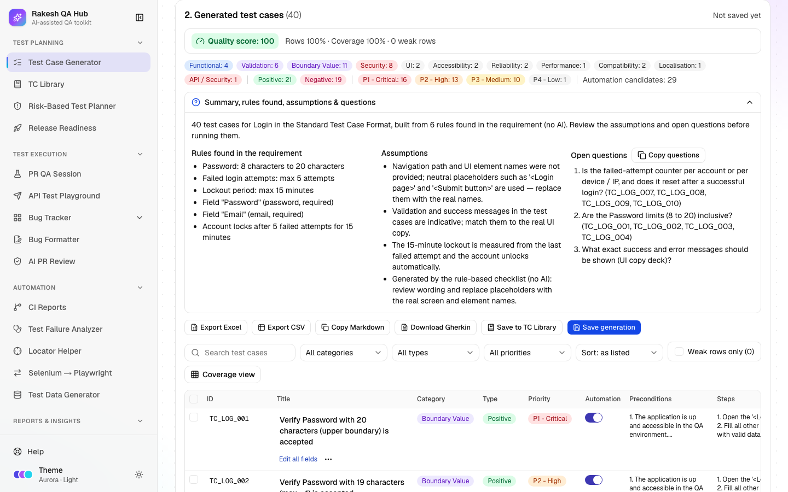

# Test Case Generator

**Section:** Test Planning · **Page:** `/test-case-generator`

## Purpose

The Test Case Generator turns a requirement into a full set of ready-to-run test cases. You paste a user story, acceptance criteria or an API definition, pick the kinds of testing you want, and get test cases in one standard format: a "Verify…" title, preconditions, numbered steps, concrete test data and a detailed expected result.

## The problem it solves

**Before:** writing test cases by hand from a requirement takes hours. Different people write them in different styles, boundary values get missed (for example "max 50 characters" is tested at 50 but not at 51), and negative cases are often forgotten.

**After:** the generator reads the requirement, finds its values, limits, fields and user roles, and writes positive and negative cases for each of them in one consistent format. A quality score tells you which rows are weak before anyone runs them, and you can export the set to Excel, CSV, Gherkin or Postman in one click.

## Who should use it and when

- **QA engineers** — at the start of a story, as soon as acceptance criteria are written, to get a first draft of test cases.
- **QA leads** — when reviewing coverage for a feature, using the Coverage view to see which acceptance criteria have no tests.
- **Developers and product owners** — during refinement, to see the edge cases a requirement implies and answer the generator's open questions early.

## Key features

- Three input types: **User story / requirement**, **API definition** (OpenAPI / Swagger JSON or YAML, a cURL command, or one endpoint described by hand) and **Upload** (`.txt`, `.md`, `.json` or `.yaml`, max 1 MB).
- Three ways to generate: **Generate with AI** (only when AI is turned on), **Copy prompt for Claude** (paste the answer back with **Import**) and **Generate checklist (no AI)**, a rule-based generator that always works.
- **Test types to generate** — 26 types in Functional, Non-Functional and API groups, with presets (Smoke, Full functional, API complete, Everything). Everything is selected by default.
- **Depth** — Quick (12–18 cases), Standard (30–45, the default) or Exhaustive (60–90).
- **More context** — module name, user roles, business rules, UI element names, known messages and an ID abbreviation, all used to make the cases more specific.
- A **Quality score** with weak rows marked, plus **Improve weak cases** (AI) or **Copy improve prompt**.
- **Coverage view** that maps each acceptance criterion to the cases that cover it.
- Exports: **Export Excel** (Test Cases, Summary and Assumptions & Queries sheets), **Export CSV**, **Copy Markdown**, **Download Gherkin**, **Export for Postman**.
- **Save to TC Library**, **Send to API Playground** and **Save generation** (History).

## How to use it



1. Open **Test Case Generator** from the **Test Planning** section of the sidebar.
2. In **1. Input & options**, choose a tab:
   - **User story / requirement** — paste the story, acceptance criteria or business rules into **Requirement**. Numbered, bulleted or "AC1:" lines feed the Coverage view.
   - **API definition** — paste an OpenAPI / Swagger file or a cURL command, or fill **Method**, **Endpoint**, **Auth** and the request/response samples.
   - **Upload** — pick a file. OpenAPI files go to API definition; anything else goes to the requirement.
3. Optional: open **More context** and fill **Module / feature name**, **User roles**, **Business rules / constraints**, **UI element names** and **Known messages**. The more you fill, the fewer placeholders you'll see.
4. Check **Test types to generate**. Use **Select all**, **Clear** or a preset. Leave **Everything** for full coverage.
5. Pick **Depth**, **Output format** (Detailed steps, Gherkin or Both) and **Priority scheme** (P1 - Critical … P4 - Low, or High / Medium / Low).
6. Click one of the generate buttons:
   - **Generate checklist (no AI)** — results appear straight away.
   - **Generate with AI** — results appear after the batches finish. You can **Cancel**.
   - **Copy prompt for Claude** — a panel opens with the prompt. Paste it into Claude, paste the answer into **Paste Claude's answer**, then click **Import**.
7. Review **2. Generated test cases**. Read the quality bar, open **Summary, rules found, assumptions & questions**, and fix weak rows (click **Edit all fields** under a title to open the full editor, or edit cells inline).
8. Export or share: **Export Excel**, **Save to TC Library**, **Send to API Playground**, or **Save generation** to keep it in **History**.

## Worked example

You paste this requirement for a "Login" module:

```
Users log in with email and password.
AC1: Password must be 8–20 characters.
AC2: After 5 failed attempts the account is locked for 15 minutes.
AC3: Show "Invalid email or password." on wrong credentials.
```

You set **Module / feature name** to "Login", leave **Everything** and **Standard** selected, and click **Generate checklist (no AI)**. You get 40 cases with a **Quality score: 100**, for example:

| ID | Title | Category | Type | Priority |
|---|---|---|---|---|
| TC_LOG_003 | Verify Password with 21 characters (max + 1) is rejected | Boundary Value | Negative | P1 - Critical |
| TC_LOG_005 | Verify Password with 7 characters (min − 1) is rejected | Boundary Value | Negative | P1 - Critical |
| TC_LOG_009 | Verify the account is locked after 5 consecutive failed attempts | Boundary Value | Negative | P1 - Critical |
| TC_LOG_012 | Verify login works again after exactly 15 minutes (and at 16 minutes) | Boundary Value | Positive | P1 - Critical |
| TC_LOG_015 | Verify login fails for an email that is not registered, without revealing it | Security | Negative | P1 - Critical |
| TC_LOG_031 | Verify Login can be completed with the keyboard only | Accessibility | Positive | P2 - High |

Each row also has preconditions, five or more numbered steps, concrete test data and detailed expected results. **Rules found in the requirement** lists "Password: 8 characters to 20 characters", "Failed login attempts: max 5 attempts" and "Lockout period: max 15 minutes". **Open questions** asks, for example, "Are the Password limits (8 to 20) inclusive?" and "Is the failed-attempt counter per account or per device / IP, and does it reset after a successful login?".

## Understanding the output

- **Table columns:**
  - **ID** — the case ID.
  - **Title** — always starts with "Verify".
  - **Category** — one of 15, e.g. Functional, Boundary Value, Security, Accessibility, API.
  - **Type** — Positive or Negative.
  - **Priority**
  - **Automation** — whether the case is a good automation candidate.
  - **Preconditions**, **Steps**, **Test data** and **Expected result**.
  - **Requirement ref** — added only when cases point to acceptance criteria.
- **Quality score** (0–100) — 70% row quality plus 30% coverage of the limits and values found in the requirement. **Green** is 80 or more, **amber** 60–79, **red** below 60.
- **Weak** badge — the row has empty test data, fewer than 5 steps, fewer than 3 expected-result lines, a title that doesn't start with "Verify", generic wording, or a duplicate title.
- **Template** badge — a generic case added because the requirement didn't give specific details for that test type.
- **"Not covered by any case"** — limits or values from the requirement that no case tests yet.
- **Summary chips** — the number of cases per category and per type.

## Tips and best practices

- Write limits as numbers ("max 50 characters", "1–10 items"). The generator turns them into boundary cases at the limit and ±1.
- Put acceptance criteria on separate numbered or "AC1:" lines so the Coverage view can match them.
- Fill **UI element names** and **Known messages** to avoid placeholder names like "Submit button".
- Start with **Generate checklist (no AI)** for a fast baseline. Use AI or Claude for richer wording.
- Answer the **Open questions** with your product owner. They are the gaps in the requirement.
- Save a generation before editing a lot. Replacing cases with unsaved edits asks first, but can't be undone.

## Limitations and things to know

- **Generate with AI** and **Improve weak cases** only appear when the hub owner has configured an AI key. Without it, use **Copy prompt for Claude** or the checklist.
- AI generation is limited to 10 runs per hour, and AI input is capped at 30 KB.
- Uploads are limited to 1 MB. Only local `$ref` references in OpenAPI files are followed.
- Your inputs are kept as a draft in your browser, but generated cases are not. Use **Save generation** to keep them.
- Deleting a saved generation needs the admin passcode.
- The generator only knows what you give it. Review every case before you run it.

## Works well with

- [TC Library](tc-library.md) — **Save to TC Library** stores the cases as Markdown so a [PR QA Session](pr-qa-session.md) can reuse them.
- [API Test Playground](api-playground.md) — **Send to API Playground** creates a collection with one request per API case, ready to send.
- [Risk-Based Test Planner](risk-planner.md) — use the plan's test depth (Light, Standard, Thorough, Full) to choose Quick, Standard or Exhaustive.
- [Test Data Generator](test-data-generator.md) — generate bulk data for the fields the cases mention.

## FAQ

**Do I need AI to use this?**
No. **Generate checklist (no AI)** works without any setup and reads values, limits, fields and roles from your requirement.

**Why are some rows marked Weak?**
They are missing something a tester needs — real test data, at least five steps, or at least three expected results. Open the row, fix it, and the score updates.

**Can I change the ID format?**
Yes. Set **Module abbreviation (for IDs)** in **More context**. "Checkout payment" becomes `TC_CP_001`.

**Where do my test cases go when I close the tab?**
Only the inputs are remembered. Click **Save generation** first, then reopen it later from **History**.

**Can I import cases written elsewhere?**
Yes. Open the Claude panel with **Copy prompt for Claude**, paste JSON or a Markdown table into **Paste Claude's answer**, and click **Import**.
