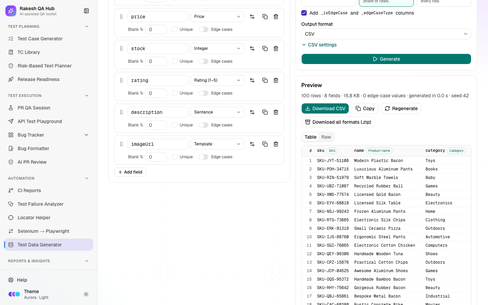

# Test Data Generator

**Section:** Automation · **Page:** `/test-data-generator`

## Purpose

The Test Data Generator creates realistic fake data for testing: names, emails, phone numbers, addresses, payments, dates and many more. It can mix in **edge cases**, the unusual but valid-looking values that often break software. You design a **schema** (the list of fields and their types), choose how many rows you want, and download the result as CSV, JSON, Excel, SQL, XML, YAML and more. Everything runs in your browser.

## The problem it solves

**Before:** test data is typed by hand ("test1", "test2"), copied from production (a privacy risk), or produced by one-off scripts. Edge cases like a 65-character email, an emoji in a name or a 29 February date are rarely tested, and nobody can recreate yesterday's data set.

**After:** you pick a preset or build a schema in a few clicks and generate up to 100,000 realistic rows. You can add a controlled share of edge cases, and use a **seed** to get exactly the same data again tomorrow.

## Who should use it and when

- **QA engineers** — when a test needs many records (pagination, search, bulk import) or tricky inputs for form validation.
- **Automation engineers** — to create data files for data-driven tests (**Use in automation** gives loader code).
- **Developers and performance testers** — to seed a test database with SQL inserts or load-test with large files.

## Key features

- **Presets:**
  - User
  - Address
  - Payment
  - Order
  - Employee
  - Product
  - Login credentials
  - API request body
  - India (KYC-style)
- **Schema** builder:
  - **Add field**, with 80 field types, searchable and grouped.
  - Per-field options, **Blank %** and **Unique**.
  - An edge-cases switch with an **Edge-case share** percentage.
  - Nested objects and lists via **Add child field**.
- **Options:**
  - **Rows** — up to 100,000.
  - **Locale** — 8 locales, e.g. English (India), English (US), German, Japanese.
  - **Seed (optional)** and **Dates relative to**.
  - **Data mode** — **Valid only**, **Mixed** or **Edge cases only**.
  - Optional `_isEdgeCase` and `_edgeCaseType` columns.
- **Output format:**
  - CSV, TSV, JSON, JSON Lines, Excel, XML or YAML.
  - SQL INSERT in 5 dialects: PostgreSQL, MySQL, SQL Server, Oracle and SQLite.
  - Each format has its own settings.
- **Preview** (first 100 rows, **Table** or **Raw**), **Copy**, **Download**, **Download all formats (.zip)** and **Regenerate**.
- **My schemas:**
  - **Save schema**, **Load**, **Duplicate**, **Rename** and **Delete**.
  - **Save as preset**.
  - **Import JSON** and **Export JSON**.
  - **Use in automation** — starter code for Java · TestNG (CSV) and Playwright · TypeScript (JSON).

## How to use it

1. Open **Test Data Generator** from the **Automation** section of the sidebar.
2. Click a preset (e.g. **User**) to fill the schema, or click **Add field** to build one yourself.
3. For each field, set a name (e.g. `email`), pick a type from the searchable list, and set its options (e.g. min/max for numbers, a domain for emails). Tick **Unique** if values must not repeat.
4. Turn on edge cases for fields where you want unusual values. In **Mixed** mode, set the **Edge-case share**.
5. In **Options**, set **Rows**, **Locale**, **Data mode** and **Output format**. Enter a **Seed** (e.g. `42`) if you'll need the same data again.
6. Click **Generate**. Check the **Preview**. Edge-case rows are marked when the extra columns are on.
7. Click **Download** (e.g. **Download CSV**), or **Download all formats (.zip)**.
8. Click **Save schema** to keep the field list and options for next time. Tick **Save as preset** to show it as a chip at the top.

## Worked example

You need 500 users for a sign-up form test, with some tricky emails.

- **Preset:** User (id, firstName, lastName, fullName, email, username, password, phone, dateOfBirth, gender, createdAt).
- **email** has edge cases switched on.
- **Options:**
  - Rows: 500
  - Locale: English (US)
  - Seed: 42
  - Data mode: Mixed (20% share)
  - Format: CSV

You click **Generate**. The preview shows rows with realistic US names, matching full names and emails, usernames, phone numbers and birth dates. About one row in five has an edge-case email, such as `user@@example.com` (double @), `user+tag@example.com` (plus-addressing), `USER.NAME@EXAMPLE.COM` (uppercase) or a 65-character local part. The `_isEdgeCase` and `_edgeCaseType` columns show which is which. You click **Download CSV** and get a file named like `test-data-500-rows.csv`. A teammate who uses the same schema, options and seed `42` gets exactly the same 500 rows.

## Understanding the output

- **Preview** — the first 100 rows. **Table** shows columns, and **Raw** shows the file text (first 200 lines). "(empty)" marks a blank value created by **Blank %**.
- **`_isEdgeCase` / `_edgeCaseType` columns** — whether a row contains an edge value and which kind (e.g. "missing @").
- **Data modes:**
  - **Valid only** — realistic values only.
  - **Mixed** — fields with edge cases switched on use them in the chosen share of rows.
  - **Edge cases only** — every field that has edge cases uses them in every row.
- **Seed** — the same seed + schema + options always produce the same data. A random run shows the seed it used, so you can repeat it.
- **Stale notice** — "The schema or data options changed since this run — press Regenerate to update the data."
- **Excel preview** — shows the same rows as CSV, because Excel is a binary format.

## Tips and best practices

- Always set a **Seed** for data used in automated tests, so failures can be reproduced.
- Use **Mixed** mode with 10–20% edge cases for form and API validation testing. Use **Valid only** for performance or demo data.
- Mark IDs, emails and usernames **Unique** when your system requires it.
- Save team schemas as presets so everyone generates data the same way.
- For SQL, pick your database's dialect so the INSERT statements run without edits.

## Limitations and things to know

- Data is fake and generated in your browser; nothing is sent to the server unless you save a schema.
- Maximum 100,000 rows. **Copy** is turned off above 5 MB; download instead.
- India-style IDs (PAN, GSTIN, IFSC and similar) are format-valid only and are **not real**. Aadhaar numbers are masked by default, and unmasked ones always fail the check digit, so they can never be real numbers.
- Card numbers are payment-sandbox test numbers, labelled "test". Never use them as real cards.
- Deleting a saved schema needs the admin passcode. Saved schemas are visible to everyone.

## Works well with

- [Test Case Generator](test-case-generator.md) — generate bulk data for the fields and limits its cases mention.
- [API Test Playground](api-playground.md) — use the **API request body** preset in JSON format for request bodies.
- [Selenium → Playwright Converter](selenium-to-playwright.md) — replace hard-coded test data in converted tests with generated files.
- [Locator Helper](locator-helper.md) — together they make data-driven UI tests sturdier.

## FAQ

**Is any of this real personal data?**
No. Everything is fake, generated by the Faker library. Domains use `example.com`, and ID numbers are designed so they can't be real.

**How do I get the same data again?**
Use the same schema, options and **Seed**. The **Dates relative to** day also matters for dates and ages; it's saved with the schema.

**Can I nest objects for JSON?**
Yes. Add an object or list field, then use **Add child field**. In CSV, Excel and SQL, nested values are written as JSON text.

**Can I generate SQL for my database?**
Yes. Choose **SQL INSERT** and pick PostgreSQL, MySQL, SQL Server, Oracle or SQLite, plus the table name and rows per INSERT.
